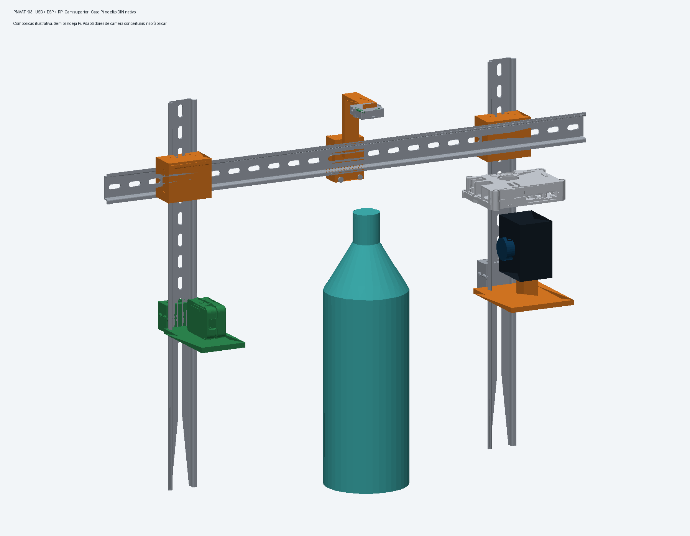
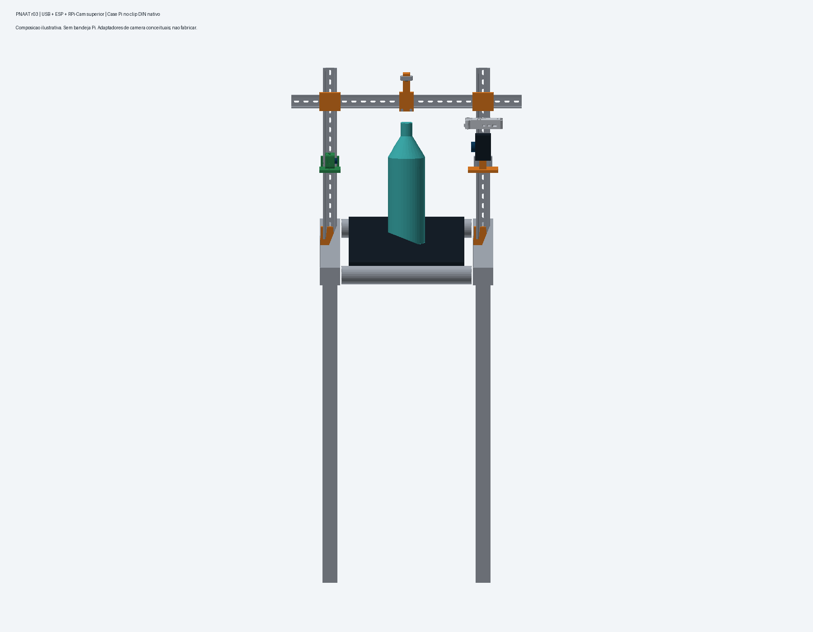
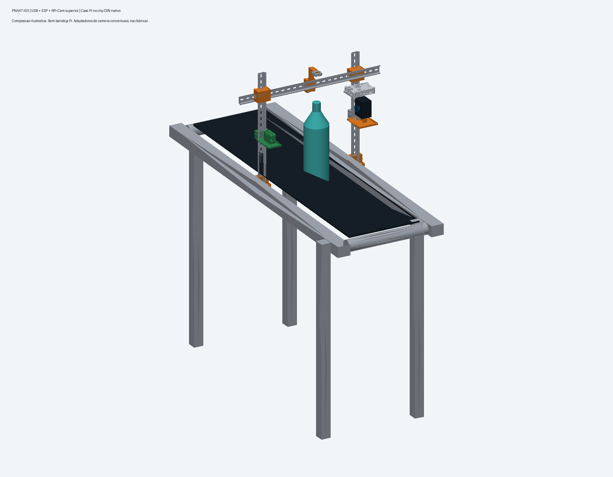

# PNAAT: inspeção multi-view e rastreabilidade em linha de envase

Sistema de inspeção para bancada de envase de garrafas PET. O repositório contém firmware, ponte serial,
serviço de captura, gateway HTTP, inferência, registro SQLite, dashboard, cadeia de treino e CAD. A ponte
em `src-production/firmware/esp32cam-test/esp32cam_site.py` é dona das portas seriais e encaminha o trigger à câmera;
`api.py` integra as superfícies do rig e da ponte por `PNAAT_RIG` e `PNAAT_PONTE`.

O manual descreve as rotas e os contratos reais. O ponto de entrada técnico é
`docs/operacao-pipeline.md`: ele separa a ponte serial, o serviço de rig, a inferência por diretório e
a ingestão persistida. A topologia e os endereços do runtime são dados de instalação, não valores
versionados.

O núcleo não controla a velocidade da esteira, não atua sobre o item, não promete acurácia sem
medição e não aprova item com evidência ausente. Atuação física, iluminação pulsada, encoder e MQTT
com múltiplos nós são expansão (`docs/escopo.md`).

## Sumário

- [1. Artefatos da entrega](#1-artefatos-da-entrega)
- [2. Rotas de execução](#2-rotas-de-execução)
- [3. Hardware e montagem](#3-hardware-e-montagem)
- [4. Requisitos de software](#4-requisitos-de-software)
- [5. Instalação passo a passo](#5-instalação-passo-a-passo)
- [6. Operar as rotas existentes](#6-operar-as-rotas-existentes)
- [7. Dataset, modelos e CAD](#7-dataset-modelos-e-cad)
- [8. Treinar o detector do zero](#8-treinar-o-detector-do-zero)
- [9. Verificação e reprodutibilidade](#9-verificação-e-reprodutibilidade)
- [10. Estrutura do repositório](#10-estrutura-do-repositório)
- [11. Limites conhecidos](#11-limites-conhecidos)
- [12. Convenções](#12-convenções)
- [13. Créditos e licenças](#13-créditos-e-licenças)

## 1. Artefatos da entrega

| Artefato | Onde está | Estado |
|---|---|---|
| Código do produto (API, pipeline, decisão, registro, site) | `src-production/` | 510 testes passam, mais 17 do firmware |
| PoCs da geração anterior | fontes removidas deste checkout | os READMEs em `docs/pocs/` são histórico, não comandos executáveis |
| Cadeia de treino (dataset, treino, avaliação, calibração, pacote) | `src-production/treino/` | pronta; rodar exige GPU e o acervo externo |
| Modelos CAD do rig | `cad-produto/` | montagem conferida geometricamente, com ressalvas na seção 3 |
| Diagramas de arquitetura | `docs/arquitetura.md`, `docs/diagramas/` | proposta e implementado, lado a lado |
| Manual de replicação | este arquivo, mais `src-production/README.md` e `src-production/treino/README.md` | publicado |
| Documento formal (Levantamento de Requisitos e roteiro do pitch) | `latex-workspace/` | fonte publicada; compilar exige LuaLaTeX |
| Pacotes de modelo (7) | [huggingface.co/Nerton/pnaat-modelos](https://huggingface.co/Nerton/pnaat-modelos) | publicado, com peso, contrato e `SHA256SUMS` por pacote |
| Índice dos pesos treinados (158 pesos, 35 famílias) | `models/INDEX.csv` | índice versionado; os pesos são dado e ficam fora do repositório |
| Serviço de rig (captura de três câmeras, série e manifest) | `src-production/rig_service/` | testes com câmera falsa: 24 rotas + 49 bordas |

### 1.1 Conferência da Entrega 6

| Exigência | Evidência versionada | Como conferir |
|---|---|---|
| Código-fonte desenvolvido | `src-production/` | `make -C src-production verificar` |
| Esquemático elétrico | `docs/diagramas/interligacao-eletrica.mmd` e projeto histórico `ESP32S3-Trigger.zip` | pinagem e cautelas na seção 3.1 |
| Diagramas finais de arquitetura | `docs/arquitetura.md` | diagramas proposta e implementada, identificados separadamente |
| Pré-requisitos e recursos | seções 3 e 4 | lista de hardware, toolchains e perfis de software |
| Instalação e dependências | seção 5 | ambiente virtual ou Docker |
| Configuração | seção 5.3 | diretórios, URLs, mapa de câmeras e token |
| Montagem e ligações | seções 3.1 e 3.2 | ligação medida antes de energizar e sequência mecânica |
| Execução | seção 6 | API, inferência, ingestão e firmware |
| Confirmação do resultado | seção 9 | comandos, respostas e resultados esperados |

Esta tabela é um índice de auditoria, não substitui os procedimentos. Caminhos que dependem de
hardware ou modelos externos estão marcados como tal; a rota local sem hardware permanece executável.

## 2. Rotas de execução

O projeto tem uma arquitetura proposta e componentes de código que podem ser executados hoje. A
separação importa para replicar sem inventar integração.

```text
sensor E18 -> nó de trigger MicroPython -> ponte serial (esp32cam_site.py) -> ESP32-CAM
                            |
                  captura materializada (série do rig)
                            |
YOLO por diretório: <capturas>/<item>/<vista>.jpg -> pacote -> decisão -> SQLite

série manifestada: manifest.json + fotos -> artefato .npz legado -> decisão -> SQLite

evento de gatilho: CSV ou API -> SQLite
```

A ponte serial `esp32cam_site.py` é o consumidor do enlace UART: decodifica frames, comanda a captura
e publica o estado da ponte. O gateway `api.py` liga rig e ponte ao registro. A rota de diretório usa
pacote YOLO; a ingestão de série usa o artefato legado; as duas persistem na mesma base.

O guia com layout de arquivos, comandos, contratos, efeitos no banco e limites está em
`docs/operacao-pipeline.md`. A replicação do zero, com firmware, serviços e verificação, está em
`docs/replicacao-ponta-a-ponta.md`. A arquitetura proposta e a arquitetura implementada, separadas uma da
outra, estão em `docs/arquitetura.md`.

## 3. Hardware e montagem

A especificação completa, com números de catálogo, pinagem, montagem e o que não foi medido, está em
`docs/hardware.md`. O resumo do que a arquitetura assume:

| Componente | Papel | Estado |
|---|---|---|
| Raspberry Pi 5 | nó de visão: captura, inferência, registro e dashboard | adotado (D-19) |
| ESP32-CAM (AI-Thinker) | nó de visão: uma foto por disparo (via `CMD_TRIG`), câmera em standby entre fotos | firmware implementado e exercitado na bancada |
| Câmeras: CSI, webcam USB e ESP32-CAM | vistas do mesmo item | papéis no `mapeamento-rig.json`, que é dado da instalação |
| Sensor fotoelétrico E18-D80NK | gatilho de presença no nó MicroPython (GPIO27, active-low); a ESP32-CAM também declara GPIO13 como fonte interna | ligação elétrica não medida |
| Impressora 3D | pórtico, suportes de câmera e cases em PETG | peças em `cad-produto/` |

O mapa de câmeras para vistas é: `lateral1` vem da ESP32-CAM, `lateral2` da webcam USB e `topo` da
câmera CSI apontada para baixo (`cad-produto/00-produto/composicao-esteira/contract.json`). Trocar
esse mapa muda a decisão do item, por isso ele é declarado e não inferido.

O esquemático elétrico do trigger está em `ESP32S3-Trigger.zip` na raiz (Wokwi: ESP32-S3 com divisor 2,2 kΩ/3,3 kΩ e GPIO27).
O firmware declara o pino e o modo elétrico esperado, e o documento de hardware marca a ligação como
não validada até a medição de bancada.

O CAD está em `cad-produto/`: a montagem em `00-produto/composicao-esteira`, as 21 peças do pórtico
em `01-estrutura/`, as peças de impressão em `02-impressao/`, o inventário com SHA-256 em
`cad-produto/MANIFEST.json` e os créditos de terceiros em `cad-produto/ATRIBUICOES.md`. A conferência
foi geométrica, com resíduo de interferência não nulo nos pares da case, abaixo do limite declarado
de 0,1 mm³. Não houve cálculo estrutural, análise térmica nem liberação metrológica.

Conjectura CAD da montagem (peças referência, não desenho de fabricação):

| Imagem | O que mostra |
|---|---|
|  | detalhe das três câmeras e da case da Raspberry Pi no trilho |
|  | vista frontal do conjunto |
|  | vista isométrica da esteira com o pórtico e as câmeras |

Os arquivos editáveis estão nos diretórios indicados
em `cad-produto/`.

### 3.1 Ligação elétrica do trigger

> **Não conecte o fio de sinal ao ESP32 antes de medir a tensão.** Desenergize a bancada para mudar
> a fiação e use GND comum. O GPIO do ESP32 aceita no máximo lógica de 3,3 V.

1. Alimente o E18-D80NK em 5 V: fio bege/marrom em `+5V` e azul em `GND`.
2. Com multímetro em tensão contínua, meça o fio preto contra GND com o sensor livre e com uma
   garrafa presente. O sinal deve ser active-low: alto em repouso e próximo de 0 V com objeto.
3. Se o sinal livre nunca passar de 3,3 V (saída open-collector pura), ligue o preto diretamente ao
   `GPIO27`; o firmware habilita o pull-up interno de 3,3 V.
4. Se o sinal livre ficar próximo de 5 V, ligue preto → `R1 2,2 kΩ` → nó do `GPIO27`, e desse nó →
   `R2 3,3 kΩ` → GND. Confirme no nó uma tensão de no máximo 3,3 V antes de conectá-lo ao GPIO.
5. `GPIO26` é apenas uma saída opcional indicadora da janela de captura; não é a ligação da
   ESP32-CAM. O trigger chega à ponte pela serial USB, e a ponte envia `CMD_TRIG` à ESP32-CAM pela
   segunda serial USB.
6. Energize e confira no monitor serial: `EV READY pin=27 out=26`, depois `EV ARMED`; uma passagem
   deve produzir exatamente um par `EV OPEN`/`EV CLOSE`.

O esquemático atualizado é `docs/diagramas/interligacao-eletrica.mmd`. O ZIP Wokwi preservado na
raiz é histórico, usa um PIR genérico e não é a fonte normativa da pinagem. Fotografias, tensão,
distância e 10 passagens com garrafa vazia e cheia devem ser registradas na validação da bancada.

### 3.2 Sequência de montagem mecânica

1. Imprima ou fabrique as peças indicadas por `cad-produto/README.md`; confira dimensões antes de
   usar os furos M6 e não trate a montagem candidata como desenho liberado para fabricação.
2. Monte `MontanteA`, `MontanteB` e `Travessa` no trilho com junções e chavetas; instale a base DIN.
3. Fixe a câmera CSI acima do trilho, eixo óptico para baixo, preservando a folga nominal de
   110,2836 mm até o topo da garrafa; valide novamente a distância para a lente realmente usada.
4. Instale ESP32-CAM e webcam USB em lados opostos, sem obstrução do item e com iluminação constante.
5. Ligue CSI ao conector da Raspberry Pi, webcam à USB e as duas ESPs a adaptadores USB-seriais
   distintos. Identifique as portas estáveis em `/dev/serial/by-id/`.
6. Declare o mapa `espcam=lateral1,usb=lateral2,csi=topo`, capture uma série de teste e confira
   visualmente se cada arquivo corresponde à vista declarada antes de habilitar decisão.

Medidas, peças, ressalvas geométricas e a lista completa de materiais estão em `docs/hardware.md`.

## 4. Requisitos de software

| Item | Uso |
|---|---|
| Python >= 3.11 e < 3.13 | produto, testes e ferramentas |
| Linux | ambiente de desenvolvimento e nó de visão |
| ESP-IDF v5.x | compilar o firmware da ESP32-CAM |
| FreeCAD com Part, Mesh e Import | reconstruir ou conferir o CAD |
| LuaLaTeX, latexmk e biber | compilar o documento formal |
| GPU com `torch` e `ultralytics` | treino e inferência YOLO; não é necessária para API e consultas locais |

`src-production/pyproject.toml` é a fonte das dependências. O runtime base declara `numpy` e
`opencv-python-headless`; os extras são `leitura` (Pillow e SciPy), `serial` (pyserial), `inferencia`
(torch, torchvision, ultralytics, scikit-learn e PyYAML) e `dev` (pytest, pytest-timeout, ruff e
PyYAML). `anomalib` não é um extra declarado neste checkout. Se for necessário para um experimento,
instale-o num ambiente separado e não o trate como pré-requisito do produto.

## 5. Instalação passo a passo

Os comandos saem da raiz do clone. Cada bloco foi rodado nesta entrega e a saída esperada está
indicada.

O Makefile raiz foi reduzido aos alvos do produto: `make install`, `make -C src-production verificar`
e `make -C src-production lint`. Para uma operação local sem
hardware, consulte `docs/operacao-pipeline.md`.

### 5.1 Obter o código

```bash
git clone https://github.com/Nertonm/tcc-pnaat.git && cd tcc-pnaat
```

### 5.2 Ambiente Python

```bash
python3.11 -m venv .venv
.venv/bin/python -m pip install --upgrade pip
.venv/bin/python -m pip install -e "src-production[dev,leitura,serial]"
```

O venv é único, na raiz do clone. O `Makefile` de `src-production/` encontra `../.venv/bin/python`.
Para treino e inferência YOLO, acrescente o extra de inferência:

```bash
.venv/bin/python -m pip install -e "src-production[inferencia]"
```

### 5.3 Configurar a instalação

Não há endereço, device ou mapa de câmera pessoal embutido no código. Declare, conforme a rota:

```bash
export PNAAT_SERIES_DIR=/caminho/gravavel/series
export PNAAT_PONTE=http://127.0.0.1:8094
export PNAAT_RIG=http://127.0.0.1:8090
export PNAAT_API_TOKEN='gere-um-token-longo-e-aleatorio'  # obrigatório fora de loopback/Docker
export PNAAT_MODELOS=/caminho/para/pesos-e-datasets       # somente treino/inferência
```

Use `/dev/serial/by-id/...` para `--serial` e `--serial-trigger`; não suponha que `ttyUSB0` seja
sempre a mesma placa. O diretório de séries precisa ser gravável pelo usuário do serviço. O mapa de
vistas não tem default e deve ser informado na ingestão como
`csi=topo,usb=lateral2,espcam=lateral1`. Endereços diferentes são permitidos, desde que as três URLs
sejam alcançáveis pelo gateway.

### 5.4 Verificar a instalação

```bash
make -C src-production verificar     # suíte do produto e do firmware
make -C src-production lint          # ruff com a configuração do projeto
```

A saída esperada é `510 passed, 4 skipped` no produto, `17 passed` no firmware e `All checks passed!`
no lint. Os quatro skips são conhecidos: três exigem `scikit-learn`, do extra `inferencia`, e um exige
o artefato `.npz` do classificador, que é dado e vive fora do git.

### 5.5 Execução conteinerizada

Como alternativa ao ambiente virtual, a composição reproduz a API, o serviço do rig e a ponte em
uma imagem Python 3.11. O perfil completo inclui a inferência e, por isso, o primeiro build pode ser
demorado. Da raiz do clone:

```bash
docker compose -f docker/docker-compose.yml build
export PNAAT_API_TOKEN='troque-este-token'
docker compose -f docker/docker-compose.yml up -d
docker compose -f docker/docker-compose.yml ps
curl -H 'Authorization: Bearer troque-este-token' http://127.0.0.1:8080/api/health
```

Os serviços `rig` e `ponte` precisam das câmeras e das portas seriais reais; sem o hardware, use
somente a API com `docker compose -f docker/docker-compose.yml up -d api`. Antes de expor a porta,
defina um `PNAAT_API_TOKEN` próprio. Os devices, o diretório de séries e todas as variáveis estão
documentados em `docker/docker-compose.yml` e em `docs/replicacao-ponta-a-ponta.md`.

### 5.6 Perfis de ambiente

O runtime cobre a demonstração e a operação. O perfil completo acrescenta o que só o treino e a
detecção de anomalia usam.

| Perfil | Instalação | O que fica disponível |
|---|---|---|
| A, produto e demonstração | `src-production[dev,leitura,serial]` | cobre testes, API e demonstração local |
| B, inferência YOLO | perfil A mais `src-production[inferencia]`, pacote e dados externos | abre o pacote e roda inferência por diretório |

O `doctor` vivia na árvore de PoCs removida deste checkout. Para treino, a localização externa é
`PNAAT_MODELOS`, consumida pelo Makefile de `src-production/`; ela deve conter os datasets montados,
runs, pesos e metadados. O export canônico do Label Studio e os dados brutos não são criados pelo
clone. Veja `dataset/README.md` para a topologia do dado e `src-production/treino/README.md` para os
scripts que o consomem.

## 6. Operar as rotas existentes

O fluxo completo está em `docs/operacao-pipeline.md`. Esta seção é o resumo executável.

### 6.1 Operação local sem hardware

Sem rig, câmera e pacote, a API ainda sobe contra um banco local. Em banco novo, o
`/api/health` inicializa o schema; consulte `docs/dados-telemetria.md` para o contrato das rotas.

```bash
.venv/bin/python src-production/api.py --db hub.db --porta 8080 --host 127.0.0.1
```

Bind fora do loopback exige token. Não existe alvo de demonstração neste checkout; o site e a API
funcionam com os dados que estiverem no banco informado.

### 6.2 Inferência YOLO com imagens já materializadas

O diretório precisa ter `<CAPTURA>/<ITEM>/lateral1.jpg`, `lateral2.jpg` e `topo.jpg`. `CAPTURA` é a
pasta pai do item.

```bash
make -C src-production smoke-detector   PACOTE=/caminho/pacote-detector   CAPTURA=/caminho/capturas   ITEM=ITM-001   DB=/caminho/hub.db   JANELA=0.4   ALINHAMENTO=declarado   EQUIPAMENTO=rig   LOCALIZACAO=bancada
```

O comando valida o pacote, aplica ROI e rotação do contrato, executa a decisão e grava SQLite. Ele
escreve no banco. O classificador YOLO do pacote lateral decide tampa nas laterais; o detector de
topo existe no acervo (`*-topo-detector-roi`, `models/INDEX.csv`) e atua como check dimensional;
CORPO não tem modelo neste pacote e a conformidade mantém o item em `inconclusivo` quando a medida
é exigida.

### 6.3 Ingestão de série manifestada

```bash
.venv/bin/python src-production/ingerir_serie.py   --serie /caminho/serie --lote L1 --db /caminho/hub.db   --roi 0.0 0.0 1.0 1.0   --mapa csi=topo,usb=lateral2,espcam=lateral1   --janela-ms 2000 --alinhamento declarado
```

A série precisa de `manifest.json` e de um mapa câmera para vista. Essa rota registra evidências e usa
o artefato `.npz` legado, não `--pacote-modelo`. Para ligar o trigger físico a ela, ainda é necessário
o serviço de rig apontado por `PNAAT_RIG` (endereço e topologia são da instalação).

### 6.4 Firmware, gatilho e API

O firmware é compilado com ESP-IDF em `src-production/firmware/esp32cam-test/`. CSV e `POST
/api/gatilho` persistem eventos de gatilho, mas não acionam captura nem inferência. A API pode ser
iniciada assim:

```bash
.venv/bin/python src-production/api.py --db hub.db --porta 8080 --host 127.0.0.1
```

Bind fora do loopback exige token. Endereços de rig, ponte serial e adaptador de modelo são dados de
instalação configurados por ambiente e não entram no repositório.

## 7. Dataset, modelos e CAD

O dataset é mantido em `dataset/` e tem guia próprio em `dataset/README.md`. Ele separa captura própria,
anotação humana, dados externos, dados derivados, pares sintéticos e scripts de trabalho. O clone não
contém a entrada canônica `dataset/TRABALHO/anotacoes-ls.csv`, os exports do Label Studio, pesos `.pt`
nem o pacote do detector. Por isso um clone limpo não reproduz treino ou inferência real sem receber
esses insumos.

| Artefato externo | Consumidor | Como é declarado |
|---|---|---|
| export de anotações | `treino/monta_v1_detector.py` | `dataset/TRABALHO/anotacoes-ls.csv` |
| datasets montados, runs e pesos | Makefile de `src-production/` | `PNAAT_MODELOS` |
| pacote YOLO | `orquestracao.py` | `--pacote-modelo` ou `PACOTE=` |
| artefato legado `.npz` | `ingerir_serie.py` | `--modelo` |
| mapa câmera -> vista | ingestão de série | `--mapa` ou `--mapa-arquivo` |

`models/INDEX.csv` é um índice de pesos e hashes; ele não significa que o peso esteja no clone. O CAD
está todo em `cad-produto/`: a montagem de referência, 21 peças estruturais, peças de impressão,
contratos geométricos, `SHA256SUMS` e atribuições. Ele é uma referência geométrica ilustrativa, não
desenho liberado para fabricação. `docs/hardware.md` explica a montagem, a pinagem e o que não foi
medido.

## 8. Treinar o detector do zero

O fluxo de treino é separado da operação e está detalhado em `src-production/treino/README.md`. Ele
consome o export de anotação, monta split por item, valida listas e rótulos, treina, avalia, calibra o
limiar na validação e empacota peso, contrato e metadados. O rotulador assistido usado na criação do
dataset não participa do runtime e sua fonte foi removida
deste checkout; `docs/reference/classificar-gemini.md` preserva o registro histórico.

Com os dados externos e uma GPU disponíveis:

```bash
make -C src-production treino-dataset TAG=v10 VISTA=lateral
make -C src-production treino-run TAG=v10 VISTA=lateral EPOCHS=150 IMGSZ=480
make -C src-production treino-avalia TAG=v10 VISTA=lateral
make -C src-production treino-kfold TAG=v10 VISTA=lateral K=5
```

O pacote de entrega é o elo entre treino e inferência, e os pacotes publicados estão em
[https://huggingface.co/Nerton/pnaat-modelos](https://huggingface.co/Nerton/pnaat-modelos). O alvo `make pacote` roda em dry-run por padrão;
use `--apply` somente depois de revisar o conteúdo e apontar `PACOTE` para um diretório externo. Em
seguida, confirme o pacote já gravado:

```bash
.venv/bin/python src-production/treino/gera_contrato_preproc.py --conferir
.venv/bin/python src-production/treino/pacote_entrega.py --pacote /caminho/pacote
```

O dataset atual basta para demonstração de conceito não para afirmar desempenho operacional.

## 9. Verificação e reprodutibilidade

| Verificação | Comando | O que ela cobre |
|---|---|---|
| Produto, 510 testes, mais 17 do firmware | `make -C src-production verificar` | decisão, registro, API, cadeia, pacote, documentação e transporte |
| Lint | `make -C src-production lint` | zero achado com a configuração do `pyproject.toml` |
| Contrato do detector | `treino/gera_contrato_preproc.py --conferir` | ROI, limiares, classes, imgsz, fingerprint e SHA-256 do peso, pelo validador do consumidor |
| Pacote do detector | `treino/pacote_entrega.py --pacote <dir>` | read-back fechado de um pacote já gravado |

Nenhum número deste repositório é afirmação solta. Os pesos e o artefato do classificador são dado
com SHA-256 registrado, em `models/INDEX.csv` e em `src-production/README.md`, e cada número tem o
script que o recomputa. O caminho completo está em `src-production/README.md`, na seção "Reproduzir o
número de capa".

O que não dá para verificar sem os dados nem a instalação: acurácia do detector, medição elétrica do
sensor e desempenho no Pi 5 em operação contínua. Esses itens estão na seção 11 e em `docs/hardware.md`.

## 10. Estrutura do repositório

```text
tcc-pnaat/
├── README.md              Este manual
├── Makefile               Atalhos: install, verificar, lint
├── CONTRIBUTING.md        Convenções de contribuição e de commit
├── src-production/        O produto: API, pipeline, decisão, registro, site, firmware e treino
│   ├── treino/            Cadeia de treino, do dataset ao pacote
│   ├── firmware/          Firmware ESP32-CAM e receptor do transporte binário
│   ├── site/              Frontend estático, servido pela API
│   └── tests/             510 testes do produto
├── cad-produto/           CAD do rig: montagem, 21 peças, peças de impressão, créditos e SHA256SUMS
├── docs/                  Guia de operação, arquitetura, hardware, requisitos, decisões e referências
├── dataset/               Amostras de método, 181 arquivos
├── models/                Índice dos pesos e pacotes publicados no Hugging Face
├── latex-workspace/       Documento formal e roteiro do pitch
```

A organização por namespace está descrita acima; a política de mídia e o que entra no histórico seguem o `.gitignore` e o gate de revisão do diff.

## 11. Limites conhecidos

1. O acionamento do E18-D80NK está no nó MicroPython de trigger (`src-production/firmware/trigger-node/esp/main.py`,
   GPIO27) e no contrato da ESP32-CAM (GPIO13). Níveis elétricos do sensor real não foram medidos; o
   fluxo foi exercitado por comando de bancada, simulador e portas da ponte.
2. A ponte serial em `src-production/firmware/esp32cam-test/esp32cam_site.py` recebe o trigger,
   comanda a câmera e publica o estado do enlace. O gateway `api.py` encaminha as rotas do rig e da
   ponte. Captura, ingestão e inferência usam contratos próprios; `docs/operacao-pipeline.md` descreve
   onde cada serviço entra e que dados persistem.
3. O número do modelo de tampa, 0,977 de acurácia com Wilson 0,882, vem do conjunto próprio, que
   conta as imagens de deformidade como `normal` no domínio da tampa. O mapeamento é deliberado e
   está em `src-production/README.md`.
4. O valor do limiar por classe não entra na impressão digital do contrato. Só ROI, rotação,
   orientação, imgsz, classes, vista e o SHA do peso são cobertos, então editar o número mantendo
   `fonte` e `calibrado` passa na validação estrutural. É lacuna conhecida, registrada no README do
   produto.
5. O CAD tem conferência geométrica e nada além disso: sem cálculo estrutural, térmico ou liberação
   metrológica.
6. Firmware, CAD e documento formal dependem de toolchains externas, ESP-IDF, FreeCAD e LuaLaTeX.
   Sem elas, os respectivos alvos param com erro declarado.

## 12. Convenções

Documentação e comentários em português, com nomes de código sem acento. Cada PoC tem README próprio,
e cada decisão entra em `docs/DECISIONS.md` com critério de fechamento.

A árvore de PoCs e seu gate de commit foram removidos deste checkout. Antes de publicar, rode a
validação disponível no produto e revise o diff de modo explícito:

```bash
make -C src-production verificar
make -C src-production lint
git diff --check
```

Um commit, uma intenção. Nunca `git add -A`, e mídia não entra no histórico. A evidência segue a
cadeia física, dado, modelo, teste e documentação (D-16), então número sem medição não entra no
texto.

## 13. Créditos e licenças

O CAD de terceiros tem crédito, fonte e licença por arquivo em `cad-produto/ATRIBUICOES.md`: o
Raspberry Pi 5 Din Rail, de Diyalec, em CC BY-SA; o DIN Rail Bracket for M6 Bolts, de ADSRMedia, em
CC BY-NC-SA 4.0; e o Raspberry Pi 4B case with RPi camera 2 arm, de Dominik Chuchlík, em CC BY 4.0.
Os modelos oficiais da Raspberry Pi e os desenhos mecânicos estão em
`cad-produto/03-referencias/freecad/`.

Os datasets públicos usados como apoio metodológico, MVTec e Roboflow, estão em
`docs/reference/datasets-externos-roboflow.md` e em `docs/reference/`. As referências técnicas com
grau de verificação estão em `docs/REFERENCIAS.md`.

As bibliotecas usadas são NumPy, OpenCV, SciPy, Pillow e pyserial no runtime; PyTorch, torchvision,
Ultralytics e scikit-learn no treino e na inferência; e Anomalib na camada de expansão. Cada uma
mantém a licença do próprio projeto. O documento formal está em `latex-workspace/`.
