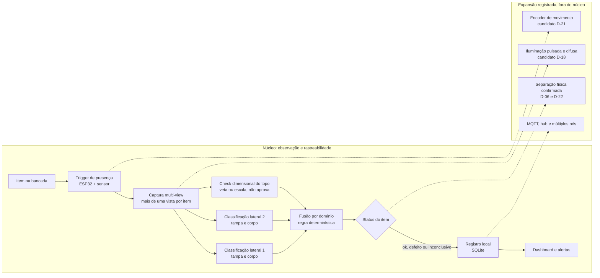

# Inspeção multi-view e rastreabilidade em linha de envase

Projeto de conclusão do módulo TCC da capacitação PNAAT 2026 (FIT), a partir do cenário 1: identificar, em uma bancada de escala reduzida, garrafas com tampa ausente, tampa mal rosqueada ou deformidade no corpo, registrar cada item e encaminhar os defeitos para análise manual.

O núcleo é uma camada de observação: um evento de presença abre a janela de captura, mais de uma vista do mesmo item é classificada por domínio, os resultados são combinados por regra determinística, e o item passa a existir como evento rastreável no registro local, consultável no dashboard. O núcleo não assume controle da velocidade da esteira nem atuação física, e a composição multi-view não fixa cardinalidade nesta fase. Atuação, iluminação pulsada, encoder e topologia distribuída (MQTT, hub, multi-nó) são expansão registrada, não capacidade do núcleo.

## Sumário

- [Arquitetura em resumo](#arquitetura-em-resumo)
- [Dependências](#dependências)
- [Estado do projeto](#estado-do-projeto)
- [Documentação](#documentação)
- [Estrutura do repositório](#estrutura-do-repositório)
- [Como começar](#como-começar)
- [Convenções](#convenções)

## Arquitetura em resumo



As duas vistas laterais decidem o domínio da tampa e o do corpo; a vista de topo é um check dimensional independente, que veta ou escala o caso mas nunca aprova sozinha (D-23). Defeito detectado em um domínio não é cancelado pelo outro (D-04), e evidência insuficiente mantém o item inconclusivo, sem aprovação silenciosa. Os componentes, o contrato do evento e o fluxo completo estão em `docs/arquitetura.md`; o recorte entre núcleo e expansão está em `docs/backlog/README.md`.

## Dependências

### Hardware

| Componente | Função na arquitetura | Status |
|---|---|---|
| Raspberry Pi 5 | Captura, inferência, registro local e dashboard | Adotado (D-19) |
| ESP32 com MicroPython | Aquisição do sinal de presença e controle temporal | Adotado (D-19) |
| Câmeras CSI e USB UVC | Captura multi-view (laterais e topo) | Modelos e quantidade definidos na PoC-01 e PoC-02 (escopo, D-03) |
| Sensor fotoelétrico E18-D80NK | Trigger de presença | Candidato (D-20) |
| Encoder incremental KY-040 | Medição de movimento | Candidato (D-21) |
| LEDs com acionamento controlado | Iluminação pulsada e difusa | Candidato (D-18) |
| Impressora 3D Creality K1C | Fabricação do rig em PETG | Disponibilidade e limites a confirmar no laboratório |

### Software e bibliotecas

| Dependência | Versão | Uso | Onde é declarada |
|---|---|---|---|
| Python | >= 3.11 e < 3.13 (verificado em 3.11.15) | Runtime do nó de visão | `code-workspace/pyproject.toml` |
| NumPy | 2.3.5 | Operações numéricas e métricas | `pyproject.toml` (dependência) |
| OpenCV (`opencv-python`) | 5.0.0.93 | Captura, ROI e processamento de imagem | `pyproject.toml` (dependência) |
| SciPy | 1.17.1 | Ajuste de elipse e intervalos de confiança | `pyproject.toml` (dependência) |
| Pillow | 12.3.0 | Manipulação de imagens em testes | `pyproject.toml` (extra `leitura`) |
| pyserial | 3.5 | Comunicação serial com o ESP32 | `pyproject.toml` (dependência) |
| pytest | 9.1.1 | Suíte de testes | `pyproject.toml` (extra `dev`) |
| anomalib | 2.6.1 | Detector one-class, camada de expansão | `pyproject.toml` (extra `anomalib`) |
| MicroPython | a definir pelo firmware em uso | Firmware do ESP32 | `code-workspace/src/pocs/poc01_trigger/esp/main.py` |
| SQLite | stdlib | Persistência do registro local | `docs/dados-telemetria.md` |

### Ferramentas e plataformas

| Ferramenta | Uso |
|---|---|
| Git e GitHub | Repositório, versionamento e publicação |
| FreeCAD, CadQuery e trimesh | Modelagem e validação do rig (`cad-workspace/`); instalação separada, fora do venv do projeto |
| LuaLaTeX, latexmk e biber | Compilação do documento formal (`latex-workspace/`) |
| Roboflow | Datasets públicos usados como apoio metodológico |
| Fatiador da K1C | Geração de G-code do lote de impressão |

As versões marcadas como "a definir" serão fixadas depois das PoCs de integração. Componentes marcados como candidatos dependem da PoC correspondente (ver `docs/DECISIONS.md`).

## Estado do projeto

A documentação de engenharia está em desenvolvimento e o código cobre parte do fluxo. O que existe hoje, com o estado verificado em `docs/pocs/README.md`:

- PoC-01 (trigger): debounce e abertura de janela implementados em `code-workspace/src/pocs/poc01_trigger/`; o firmware do ESP32 está em `esp/main.py` e o protocolo do ensaio físico, com pacote de evidência, em `docs/entrega2/ROTEIRO-VIDEO.md`.
- PoC-04 (fusão): implementada por domínio, com a regra que impede o cancelamento de defeito por outra vista e trata a vista de topo como veto (D-04, emenda D-23, D-29).
- PoC-05, PoC-06 e PoC-07: registro, retry e dashboard existem em versão parcial e declarada assim nas fichas.
- PoC-08 (pré-processamento): implementada e testada como MVP.
- PoC-02 (classificação de tampa) e PoC-03 (deformidade lateral): não integradas; dependem de conjunto de dados com itens defeituosos e de calibração dimensional.
- CAD: base, peça de plataformas e mount de câmera validados em `cad-workspace/INDICE.md`; a folga de encaixe foi validada em ensaio de impressão registrado em `cad-workspace/lote-impressao-20260911/PLANO-FATIAMENTO.md`.

Metas de requisito não são resultados: os números de RNF-01, RNF-02 e RNF-05 permanecem metas até a medição no setup declarado.

## Documentação

| Documento | Conteúdo |
|---|---|
| `docs/README.md` | Índice completo da documentação, por objetivo |
| `docs/escopo.md` | Cenário, núcleo da proposta, limites e restrições |
| `docs/arquitetura.md` | Diagrama, componentes, contrato do evento e expansões |
| `docs/requisitos.md` | Catálogo RF-01 a RF-30 e RNF-01 a RNF-21, com escopo núcleo ou expansão |
| `docs/requisitos/` | Fichas detalhadas por domínio (funcionais, não funcionais, dados e interfaces, hardware e ML, operação) |
| `docs/DECISIONS.md` | 29 decisões técnicas com opções, direção, regras e critério de fechamento |
| `docs/dados-telemetria.md` | Schema do registro, taxonomia de defeitos e consultas analíticas |
| `docs/pocs/` | Protocolo e fichas das provas de conceito, mais o mapa entre a numeração antiga e a entregue |
| `docs/metodologia.md` | Método do trabalho e critério de testabilidade |
| `docs/FLUXOS.md` | Fluxos canônicos, cada um com gate e evidência |
| `docs/SANITIZACAO.md` | O que nunca entra no repositório e como verificar |
| `docs/REFERENCIAS.md` | Referências com grau de verificação (P, S, B, N) |
| `docs/reference/` | Notas de referência, medições e auditorias |
| `docs/design/` | Especificações de design: grip, pré-processamento PET e adaptação de detector |
| `docs/backlog/` | Artefatos da geração anterior rotulados como expansão |
| `docs/entrega1-estado-final.md` | Estado e pendências do documento entregue na Entrega 1 |
| `docs/entrega2/` | Roteiro, checklist de rubrica e texto da apresentação da Entrega 2 |
| `latex-workspace/` | Fonte do documento formal (Levantamento de Requisitos e roteiro do pitch) |

## Estrutura do repositório

```text
tcc-pnaat/
├── README.md                  Este arquivo: arquitetura, dependências, estrutura e preparação
├── CONTRIBUTING.md            Convenções de contribuição e de commit
├── docs/                      Documentação normativa (requisitos, decisões, PoCs, dados)
├── code-workspace/            Código das PoCs
│   ├── src/pocs/              Um pacote por PoC, mais o contrato de evento
│   ├── scripts/               Ferramentas: demo, treino, calibração, doctor, gate
│   ├── tests/                 Suíte pytest
│   ├── notebooks/             Apoio exploratório (sem saídas versionadas)
│   ├── demo/                  Entrada e saída da demonstração local
│   └── Makefile               Atalhos: test, demo, doctor, sanitizar, poc04
├── cad-workspace/             Pipeline mecânico
│   ├── cad/, scripts/         Fontes CadQuery e validadores
│   ├── exports/               CAD gerado (fora do versionamento)
│   ├── reports/, data/g0/     Laudos de referência e canários de medição
│   └── INDICE.md              Veredito de cada artefato (válido, reprovado, conceito)
├── latex-workspace/           Documento formal
│   ├── main.tex, texto/       Levantamento de Requisitos
│   └── Roteiro.tex            Roteiro do vídeo pitch
├── evidencias/                Índice da cadeia de evidência (manifests, medições, vídeos)
└── dataset/                   Imagens do rig versionadas por decisão do grupo
```

Não são versionados, por política (`docs/SANITIZACAO.md`): mídia bruta do experimento, credenciais, caminhos e identificadores de infraestrutura, STEP e STL de terceiros, checkpoints e pesos de modelo, saídas de medição locais e o próprio conjunto de dados canônico (`datasets/pnaat/`). Arquivos com recibo `.sha256` ou manifest são evidência e não devem ser reescritos.

## Como começar

Cada passo corresponde a uma dependência listada acima. Comandos executados a partir da raiz do repositório.

1. Obter o código:

```bash
git clone <url-do-repositorio> tcc-pnaat && cd tcc-pnaat
```

2. Ambiente Python (NumPy, OpenCV e pyserial (dependencias); SciPy e Pillow no extra `leitura`; extra `dev` com pytest e ruff). O venv é único, na raiz do clone, e o projeto roda em Python 3.11 (o `python3` do host pode ser mais novo e quebrar o extra `anomalib`):

```bash
python3.11 -m venv .venv
.venv/bin/python -m pip install --upgrade pip
.venv/bin/python -m pip install -e "code-workspace[dev]"
```

O extra `anomalib` é necessário apenas para a camada de detecção de anomalia:

```bash
.venv/bin/python -m pip install -e "code-workspace[anomalib]"
```

Os alvos do `Makefile` encontram esse venv automaticamente (`../.venv` a partir de `code-workspace/`).

3. Verificar a instalação com a suíte de testes e o diagnóstico de ambiente:

```bash
make -C code-workspace test
make -C code-workspace doctor
```

4. Dados: o conjunto canônico fica fora do repositório e é apontado por variável de ambiente. As imagens em `dataset/` são as versionadas por decisão do grupo.

```bash
export PNAAT_DATASETS="$HOME/tcc-pnaat/datasets/pnaat"
test -d "$PNAAT_DATASETS/dataset/normal"
```

5. Demonstração do fluxo (gatilho, pré-processamento, decisão, registro e dashboard):

```bash
make demo
```

6. Firmware e bancada (pyserial e ESP32): o pino de presença e a porta serial estão declarados no firmware e na ferramenta de bancada.

```bash
python -m serial.tools.list_ports
python scripts/esp_tool.py --help
```

7. CAD (opcional): a validação do rig usa CadQuery, trimesh e FreeCAD headless, que não fazem parte do venv do projeto e exigem instalação própria. Sem eles, `make -C cad-workspace canary` e `validate-optical-rig` param com `ModuleNotFoundError: cadquery`. O estado verificado de cada artefato está em `cad-workspace/INDICE.md`, e a verificação no ambiente de origem em `cad-workspace/TRANSFER.md`. Os STEP e STL ficam em `cad-workspace/exports/`, fora do versionamento.

```bash
make -C cad-workspace validate-g0   # valida os templates G0 (sem CadQuery)
make -C cad-workspace canary        # exige CadQuery e trimesh instalados
```

8. Documento (LuaLaTeX, latexmk e biber): o documento formal e o roteiro do pitch.

```bash
make -C latex-workspace all                     # Levantamento de Requisitos (main.tex)
latexmk -lualatex latex-workspace/Roteiro.tex   # roteiro do vídeo pitch
```

A seção `texto/aceite.tex` ainda tem campos marcados com `\field` a preencher; `make -C latex-workspace check-final` acusa cada um antes da entrega final.

9. Higiene antes de commitar: o gate roda testes, sanitizador e checagem de mídia no staging. O `core.hooksPath` é configuração local e não é herdada por clone, então cada checkout precisa instalar o gate uma vez.

```bash
make -C code-workspace hooks     # instala o gate neste clone
make -C code-workspace sanitizar # checagem de higiene (sai != 0 se houver achado)
```

Bypass consciente: `PNAAT_HOOK_BYPASS=1` **e** o trailer `Bypass: <motivo>` na mensagem do commit — o gate confere o trailer e recusa o escape sem motivo declarado.

## Convenções

- Documentação e comentários em português; nomes de variáveis e funções em inglês ou em português sem acento.
- Cada PoC possui README próprio em `code-workspace/src/pocs/pocNN_*/README.md`.
- Decisões registradas em `docs/DECISIONS.md` com regra de atualização por evidência.
- Classes canônicas: `normal`, `tampa_ausente`, `tampa_mal_rosqueada`, `inconclusivo` (D-28).
- Evidência segue a cadeia `física -> dados -> modelo -> teste -> documentação` (D-16).
- Requisito é meta; README de PoC é protocolo; código é mecanismo; evidência é o que aconteceu; decisão interpreta a evidência.
- Commit passa pelo gate versionado em `code-workspace/scripts/commit_gate.sh`; o escape consciente é `PNAAT_HOOK_BYPASS=1` e o motivo deve ser registrado na mensagem do commit.
