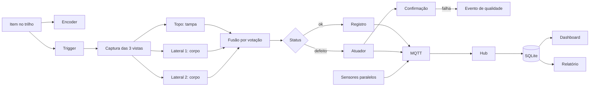

# Inspeção multi-view e rastreabilidade em linha de produção

Projeto de conclusão do módulo TCC da capacitação PNAAT 2026 (FIT), a partir do cenário 1: identificar, em uma bancada de escala reduzida, garrafas com tampa ausente, tampa mal rosqueada ou deformidade no corpo, registrar cada item e separar defeitos para análise manual.

O sistema usa três câmeras sincronizadas por trigger físico, um classificador por vista, fusão por votação, telemetria de sensores paralelos, persistência em SQLite e um dashboard local. A decisão e a atuação são registradas como eventos observáveis.

## Arquitetura em resumo

O diagrama completo e a revisão dos componentes estão em `docs/arquitetura.md`.

## Estado do projeto

A documentação de engenharia está em desenvolvimento. A entrega atual é a especificação de requisitos. Ainda não há implementação, firmware, dataset validado ou resultado de ensaio registrado. As metas descritas nos documentos não são medições.

## Documentação

- `docs/requisitos.md`: requisitos funcionais e não funcionais, pitch, cronograma e critérios de aceite.
- `docs/requisitos/`: fichas detalhadas por domínio.
- `docs/escopo.md`: decisões de escopo, indicadores, riscos e limites.
- `docs/arquitetura.md`: diagrama e revisão dos componentes.
- `docs/dados-telemetria.md`: schema, consultas e taxonomia de defeitos.
- `docs/pocs/`: protocolo e fichas das provas de conceito.
- `docs/DECISIONS.md`: posições de decisão em aberto, com opções e critérios de confirmação.

## Convenções

Ver `CONTRIBUTING.md` para commits, teste, PoC e fluxo de revisão.
