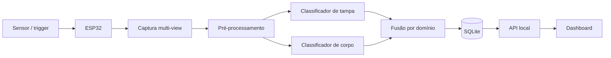

# Inspeção multi-view e rastreabilidade em linha de envase

Projeto de conclusão do módulo TCC da capacitação PNAAT 2026 (FIT). A solução observa uma
linha de envase em escala reduzida, captura mais de uma vista de cada garrafa PET, classifica
defeitos de tampa e corpo, combina as evidências sem aprovar silenciosamente casos incompletos e
registra o resultado para consulta no dashboard local.

> **Status de entrega:** o repositório contém o produto, os testes, o firmware, os modelos CAD e
> a documentação. A classificação de tampa possui cadeia implementada; a classificação de corpo
> e a integração elétrica com o sensor real permanecem experimentais. Consulte
> [`docs/entrega6/README.md`](docs/entrega6/README.md) antes de apresentar resultados.

## Sumário

- [O que é entregue](#o-que-é-entregue)
- [Arquitetura](#arquitetura)
- [Pré-requisitos](#pré-requisitos)
- [Instalação](#instalação)
- [Configuração](#configuração)
- [Executar e confirmar](#executar-e-confirmar)
- [Montagem elétrica e mecânica](#montagem-elétrica-e-mecânica)
- [Estrutura e documentação](#estrutura-e-documentação)
- [Limitações conhecidas](#limitações-conhecidas)

## O que é entregue

| Artefato | Local | Situação |
|---|---|---|
| Código do produto e testes | [`src-production/`](src-production/) | entregável principal |
| Dashboard e API local | [`src-production/site/`](src-production/site/) e `api.py` | implementados e testados |
| Firmware ESP32-CAM | [`src-production/firmware/`](src-production/firmware/) | bancada; sensor real pendente |
| Esquemático ESP32-S3 de trigger | [`docs/hardware/esp32s3-trigger/`](docs/hardware/esp32s3-trigger/) | simulação Wokwi, não diagrama de produção |
| Modelos mecânicos e montagem | [`cad-produto/`](cad-produto/) | CAD final versionado, com verificações geométricas |
| Documentação de engenharia | [`docs/`](docs/) | arquitetura, requisitos, dados, decisões e PoCs |
| PoCs anteriores | [`code-workspace/`](code-workspace/) | histórico; não é o produto final |
| Documento acadêmico | [`latex-workspace/`](latex-workspace/) | fontes LaTeX |
| Evidências | [`evidencias/`](evidencias/) e [`models/INDEX.csv`](models/INDEX.csv) | índices e recibos versionados |

## Arquitetura



A decisão é *fail-closed*: falta de vista, evidência inadequada ou falha de modelo gera resultado
`inconclusivo`, nunca `normal`. A vista de topo auxilia e pode vetar, mas não aprova sozinha. O
fluxo detalhado, contratos e expansões estão em [`docs/arquitetura.md`](docs/arquitetura.md); a
implementação de produção está descrita módulo a módulo em
[`src-production/README.md`](src-production/README.md).

## Pré-requisitos

### Obrigatórios para executar o software

- Linux, macOS ou WSL com Git e `make`;
- Python **3.11** (o projeto aceita `>=3.11,<3.13`, mas a entrega foi verificada em 3.11);
- `venv` e `pip` disponíveis para esse Python;
- aproximadamente 2 GB livres para o ambiente básico (mais espaço para Torch, pesos e datasets).

Dependências básicas são declaradas em [`src-production/pyproject.toml`](src-production/pyproject.toml):
NumPy e OpenCV. O extra `dev` adiciona pytest, pytest-timeout, Ruff e PyYAML; `leitura` adiciona
Pillow e SciPy; `inferencia` adiciona Torch, torchvision, Ultralytics e scikit-learn.

### Hardware da bancada completa

- Raspberry Pi 5 (ou computador Linux para reprodução sem bancada);
- câmeras CSI/USB e ESP32-CAM conforme o mapa do rig;
- ESP32-S3 e sensor de presença, quando o trigger físico for utilizado;
- estrutura impressa descrita em [`cad-produto/README.md`](cad-produto/README.md).

O teste automatizado e o dashboard podem ser usados sem esse hardware. Treinar ou executar o
detector real requer dataset e pacote de modelo mantidos fora do Git por tamanho e privacidade.

## Instalação

Execute a partir da raiz do clone:

```bash
git clone <URL-DESTE-REPOSITORIO> tcc-pnaat
cd tcc-pnaat
python3.11 -m venv .venv
.venv/bin/python -m pip install --upgrade pip
.venv/bin/python -m pip install -e "./src-production[dev,leitura]"
```

Para inferência YOLO, instale também o extra pesado:

```bash
.venv/bin/python -m pip install -e "./src-production[inferencia]"
```

`<URL-DESTE-REPOSITORIO>` é intencional: substitua pela URL do repositório definitivo da equipe
antes da divulgação. Não há credencial, hostname pessoal ou caminho absoluto embutido no projeto.

## Configuração

Os testes básicos não exigem variáveis de ambiente. Para treino e inferência reais, declare:

```bash
export PNAAT_DADOS=/caminho/para/dados
export PNAAT_MODELOS=/caminho/para/pesos-e-runs
```

- `PNAAT_DADOS`: datasets e capturas que não são versionados;
- `PNAAT_MODELOS`: pesos, datasets derivados, runs e pacotes calibrados.

O detector só aceita um pacote que contenha peso, contrato de pré-processamento, limiares
calibrados, metadados e checksums. A forma de produzir e conferir esse pacote está em
[`src-production/README.md`](src-production/README.md#um-contrato-so-calibrado-nao-existe-modo-provisorio).

## Executar e confirmar

### 1. Verificação automatizada

```bash
make -C src-production verificar
.venv/bin/python -m ruff check --select F src-production
```

O primeiro comando testa produto e firmware. O segundo executa o gate de correção (nomes
indefinidos, imports mortos e código inalcançável) usado pela entrega. O resultado esperado é
retorno zero; o pytest apresenta a contagem de testes aprovados e o Ruff imprime
`All checks passed!`. `make -C src-production lint` executa também a dívida de estilo documentada
em `src-production/README.md` e ainda não é um gate verde.

### 2. Dashboard local com dados demonstrativos

Crie um banco de demonstração e inicie a API na mesma origem do site:

```bash
.venv/bin/python src-production/semear_demo.py /tmp/pnaat-demo.db
.venv/bin/python src-production/api.py --db /tmp/pnaat-demo.db \
  --site src-production/site --host 127.0.0.1 --porta 8080
```

Abra <http://127.0.0.1:8080>. A confirmação visual é o dashboard preenchido com os eventos do
banco de demonstração. Encerre com `Ctrl+C`. `api.py --help` lista as opções do servidor; o único
argumento de `semear_demo.py` é o caminho opcional do banco (o padrão é `hub.db`).

### 3. Pipeline com pacote real

Não há peso fictício ou fallback silencioso. Com um pacote calibrado e uma captura válida:

```bash
make -C src-production smoke-detector \
  PACOTE=/caminho/pacote CAPTURA=/caminho/captura ITEM=lote-0001 \
  DB=/tmp/hub.db JANELA=3600 ALINHAMENTO=declarado \
  EQUIPAMENTO=rig-bancada LOCALIZACAO=bancada
```

O comando retorna um evento e persiste o item no SQLite. Pacote inválido, parâmetro ausente,
vista insuficiente ou evidência inadequada para decisão falha explicitamente ou resulta em
`inconclusivo`.

## Montagem elétrica e mecânica

O esquemático recebido para o ESP32-S3 foi aberto e documentado em
[`docs/hardware/esp32s3-trigger/README.md`](docs/hardware/esp32s3-trigger/README.md). Ele representa
uma simulação Wokwi com PIR e divisor resistivo; **não autoriza ligação do E18-D80NK real**. Antes
da montagem física, confirme tipo de saída, tensão, GND comum e condicionamento para 3,3 V. O
firmware ESP32-CAM também registra os pinos, o protocolo e as pendências elétricas em
[`src-production/firmware/README.md`](src-production/firmware/README.md).

A montagem mecânica, peças, imagens, integridade e atribuições estão em
[`cad-produto/README.md`](cad-produto/README.md), [`cad-produto/MANIFEST.json`](cad-produto/MANIFEST.json)
e [`cad-produto/ATRIBUICOES.md`](cad-produto/ATRIBUICOES.md).

## Estrutura e documentação

```text
tcc-pnaat/
├── src-production/     produto, testes, firmware, treino, API e site
├── docs/               arquitetura, requisitos, decisões e documentação da entrega
├── cad-produto/        modelos CAD, peças, verificações e atribuições
├── code-workspace/     PoCs históricas (não importadas pelo produto)
├── latex-workspace/    fontes do documento acadêmico
├── evidencias/         índices da cadeia de evidências
├── dataset/            material versionado permitido pela política
└── models/             índice de modelos; pesos ficam fora do Git
```

Comece pelo [`índice da documentação`](docs/README.md). Para a Entrega 6, a matriz entre cada
critério, seu artefato e sua limitação está em [`docs/entrega6/README.md`](docs/entrega6/README.md).
As regras de segurança e sanitização estão em [`docs/SANITIZACAO.md`](docs/SANITIZACAO.md).

## Limitações conhecidas

- o modelo de tampa possui cadeia de treino/inferência; o modelo de corpo medido não atingiu
  desempenho útil e não deve ser apresentado como pronto;
- os pesos e o dataset canônico não são versionados; a reprodução da inferência real exige os
  arquivos externos conferidos por hash;
- o trigger do sensor real, debounce, níveis elétricos e integração completa Pi ↔ ESP ainda não
  foram validados no hardware final;
- o CAD foi verificado geometricamente, mas não constitui desenho de fabricação nem validação
  estrutural, térmica ou metrológica;
- o dashboard é local e não deve ser exposto à Internet sem uma camada adicional de implantação e
  segurança.

Essas limitações são declaradas para separar código existente, evidência medida e trabalho futuro.
Não apresente metas de requisitos como resultados experimentais.
