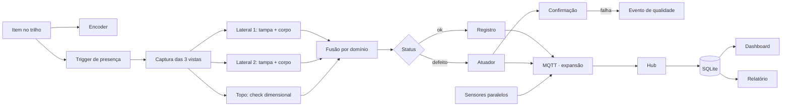

# Inspeção multi-view e rastreabilidade em linha de envase

Projeto de conclusão do módulo TCC da capacitação PNAAT 2026 (FIT), a partir do cenário 1: identificar, em uma bancada de escala reduzida, garrafas com tampa ausente, tampa mal rosqueada ou deformidade no corpo, registrar cada item e separar defeitos para análise manual.

O sistema usa três câmeras sincronizadas por trigger físico, um classificador por vista, fusão por domínio, telemetria de sensores paralelos, persistência em SQLite e um dashboard local. A decisão e a atuação são registradas como eventos observáveis.

## Arquitetura em resumo



As duas vistas laterais decidem o domínio da tampa e do corpo; a vista de topo é um check dimensional independente que pode escalonar, mas não aprova sozinha (ver `docs/DECISIONS.md`, D-23). O diagrama completo e a revisão dos componentes estão em `docs/arquitetura.md`.

## Dependências

### Hardware

| Componente | Função | Status |
|---|---|---|
| Raspberry Pi 5 | Captura, inferência, persistência e dashboard | Adotado (D-19) |
| ESP32 | Aquisição de sinais físicos e controle temporal | Adotado (D-19) |
| 2× câmeras CSI + 1× câmera USB UVC | Captura multi-view (laterais + topo) | Adotado (D-03) |
| Sensor fotoelétrico E18-D80NK | Trigger de presença | Candidato (D-20) |
| Encoder incremental KY-040 | Medição de movimento | Candidato (D-21) |
| LEDs com acionamento controlado | Iluminação pulsada/difusa | Candidato (D-18) |

### Software e bibliotecas

| Dependência | Versão | Uso |
|---|---|---|
| Python | ≥ 3.10 | Runtime principal (Raspberry Pi) |
| MicroPython | — | Firmware do ESP32 |
| OpenCV (`opencv-python`) | — | Processamento de imagem e captura |
| NumPy | — | Operações numéricas |
| SciPy | — | Ajuste de elipse, intervalos de confiança |
| Pillow | — | Manipulação de imagens em testes |
| anomalib | 2.6.1 | Detecção de anomalia (expansão) |
| pyserial | — | Comunicação serial com ESP32 |
| pytest | — | Testes unitários |
| SQLite | stdlib | Persistência local de eventos |

### Ferramentas e plataformas

| Ferramenta | Uso |
|---|---|
| GitHub | Repositório e controle de versão |
| LuaLaTeX + latexmk | Compilação do documento formal |
| FreeCAD / CadQuery | Modelagem CAD da bancada e do grip |
| Roboflow | Datasets públicos de apoio metodológico |

As versões que não estão fixadas serão definidas após as PoCs de integração. Componentes marcados como "Candidato" dependem de validação na PoC correspondente (ver `docs/DECISIONS.md`).

## Estado do projeto

A documentação de engenharia está em desenvolvimento. A entrega atual é vídeo das principais POCs, acompanhado de roteiro e do repositório no GitHub. O gatilho de presença (PoC-01) está implementado e operando com hardware real (E18-D80NK + ESP32); o pré-processamento determinístico (PoC-08) está implementado e testado como MVP — ver docs/pocs/README.md para o estado detalhado por PoC.

## Documentação

| Documento | Conteúdo |
|---|---|
| `docs/escopo.md` | Cenário, núcleo da proposta, limites e restrições |
| `docs/arquitetura.md` | Diagrama, componentes, contrato do evento e expansões |
| `docs/requisitos.md` | Requisitos funcionais (RF-01 a RF-30) e não funcionais (RNF-01 a RNF-21) |
| `docs/pocs/` | Protocolo e fichas das provas de conceito (PoC-01 a PoC-Final) |
| `docs/DECISIONS.md` | 28 decisões técnicas com opções, direção, regras e fallback |
| `docs/REFERENCIAS.md` | Referências com grau de verificação (P/S/B/N) |

Para navegação detalhada, ver `docs/README.md`.

## Estrutura do repositório

```
tcc-pnaat/
├── docs/                  Documentação técnica e decisões
├── code-workspace/        PoCs em Python (src/, scripts/, tests/)
├── cad-workspace/         Pipeline CAD (CadQuery/FreeCAD)
├── dataset/               Imagens versionadas do rig
├── evidencias/            Cadeia de evidências (manifests, fotos, medições)
└── latex-workspace/       Documento formal em LaTeX
```

## Como começar

```bash
cd code-workspace
python3 -m venv .venv
.venv/bin/pip install -e . pytest numpy scipy opencv-python Pillow
make test
```

Para dependências adicionais (anomalib, pyserial), ver `code-workspace/README.md`.

## Convenções

- Documentação e comentários em português; nomes de variáveis e funções em inglês ou em português sem acento.
- Cada PoC possui README próprio em `code-workspace/src/pocs/pocNN_*/README.md`.
- Decisões registradas em `docs/DECISIONS.md` com regra de atualização por evidência.
- Classes canônicas: `normal`, `tampa_ausente`, `tampa_mal_rosqueada`, `inconclusivo` (D-28).
- Evidência segue a cadeia `física → dados → modelo → teste → documentação` (D-16).
