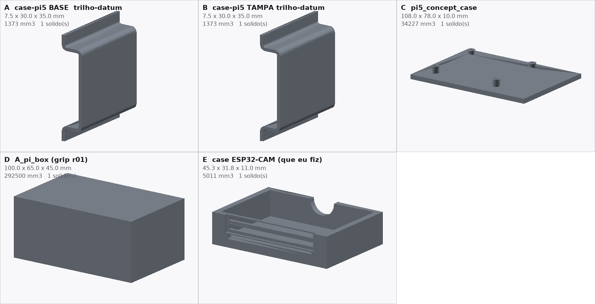

# CAD 

Peças e montagem de referência do pórtico de inspeção multi-view de garrafas PET
do TCC. O eixo Z é a altura.

## Imagens

Detalhe das três câmeras e da case da Raspberry Pi no trilho:


Vista frontal:


Cases de Raspberry Pi avaliadas, lado a lado:



## O que tem na pasta

```
00-produto/            montagem e prévias
  composicao-esteira/  revisão r03: modelo, imagens, contrato e verificações
01-estrutura/          as 21 peças do pórtico, separadas
02-impressao/
  base-trilho/         base de chão do trilho
  camera-lateral/      suporte lateral da câmera
  case-esp32cam/       case da ESP32-CAM
  case-pi-din/         case da Raspberry Pi 5 para trilho DIN
03-referencias/        modelos de referência
ATRIBUICOES.md         autor, fonte e licença de cada modelo de terceiro
MANIFEST.json          inventário por arquivo, com origem, bytes e SHA-256
SHA256SUMS             conferência de integridade
```

### 00-produto

| arquivo | conteúdo |
|---|---|
| `00-produto/composicao-esteira/composicao.stl` | montagem completa, 51 corpos |
| `00-produto/composicao-esteira/composicao-iso.png` | vista geral |
| `00-produto/composicao-esteira/composicao-detalhe.png` | detalhe das câmeras e da case |
| `00-produto/composicao-esteira/composicao-frente.png` | vista frontal |
| `00-produto/composicao-esteira/contract.json` | referencial e conteúdo da montagem |
| `00-produto/composicao-esteira/build.py` | script que monta o conjunto |
| `00-produto/composicao-esteira/verify.py` | script que confere o conjunto |
| `00-produto/composicao-esteira/verification-build.json` | conferências feitas na montagem |
| `00-produto/composicao-esteira/verification-readback.json` | conferências feitas na reabertura |
| `00-produto/conjunto-portico.stl` | só a estrutura do pórtico |
| `00-produto/completo-iso.png` | cópia de `00-produto/composicao-esteira/composicao-iso.png` |
| `00-produto/completo-frente.png` | cópia de `00-produto/composicao-esteira/composicao-frente.png` |
| `00-produto/case-no-trilho-closeup.png` | cópia de `00-produto/composicao-esteira/composicao-detalhe.png` |

### 01-estrutura

As 21 peças do pórtico em `.stl`, uma por arquivo: MontanteA e MontanteB,
Travessa, JuncaoA e JuncaoB, ChavetaA e ChavetaB, A_BRACKET, B_BRACKET,
A_CLAMP, B_CLAMP, A_PECA, B_PECA, ClampFunctionalSource e ClampFunctionalSourceB,
PecaDuplaPlataformasOFICIAL e PecaDuplaPlataformasOFICIALB, ParafusoTravaH_A e
ParafusoTravaH_B, ParafusoTravaV_A e ParafusoTravaV_B.

### 02-impressao

| pasta | conteúdo |
|---|---|
| `base-trilho/` | base que recebe a peça do bracket já impressa, com furo passante para parafuso M6, em `.stl` e `.step`, mais a documentação da peça |
| `camera-lateral/` | suporte lateral em seis peças, em `.stl` e `.step`, com as duas peças de origem de terceiro marcadas no nome do arquivo |
| `case-esp32cam/` | case da ESP32-CAM para trilho DIN, em `.step` |
| `case-pi-din/` | case da Raspberry Pi 5 para trilho DIN, em `.stl`, com o desenho do autor e os arquivos de licença |
| `02-impressao/cases-candidatas.png` | comparação entre as cases avaliadas |

### 03-referencias

Modelos oficiais da Raspberry Pi e desenhos mecânicos, com README próprio na
subpasta `freecad/`.

## O que foi feito

Montagem de referência com esteira de exemplo, pórtico de dois montantes DIN,
travessa e três câmeras.

A case da Raspberry Pi entra pelo encaixe de trilho que a própria peça já tem,
sem bandeja e sem suporte extra. O encaixe foi localizado na lateral da peça de
origem e a case é posicionada com um giro de um quarto de volta em Z.

As câmeras ficaram assim: uma no topo, voltada para baixo e sobre a esteira; uma
webcam USB em uma lateral; uma ESP-CAM na lateral oposta.

As 21 peças do pórtico foram separadas em `01-estrutura/`.

A base de chão do trilho recebe a peça do bracket já impressa, leva um parafuso
passante M6 e quatro furos de fixação. A posição do furo veio da medição do
conjunto M6 em posição de uso, não de suposição.

A case da ESP32-CAM foi desenhada a partir das medidas de catálogo do módulo
AI-Thinker.

Os arquivos exportados foram reabertos e conferidos. As medidas exatas estão em
`00-produto/composicao-esteira/verification-build.json` e
`00-produto/composicao-esteira/verification-readback.json`.

## Conferências

Foram conferidos o número de corpos, sólidos e triângulos, o tamanho do conjunto,
o apontamento da câmera de topo, a folga dela até a garrafa e o encaixe da case
no trilho. Nenhum par de peças apresentou interferência.

O encaixe da case foi medido com controle: empurrar a case para dentro ou para
fora faz o teste acusar colisão, e afastar a peça faz o teste acusar zero. Isso
mostra que o teste detecta penetração, e não que a case esteja travada.

As conferências são geométricas. Não cobrem carga, vibração, fadiga, retenção do
encaixe, foco, campo de visão nem impressão.

## Referências e créditos

A lista completa, com autor, fonte, licença e onde cada modelo foi usado, está
em `ATRIBUICOES.md`. Cada licença foi lida do arquivo que veio no próprio
download.

Três modelos de terceiro entraram no produto:

| modelo | autor | fonte | licença | onde |
|---|---|---|---|---|
| Raspberry Pi 5 Din Rail | Diyalec | Thingiverse 6335141 | CC BY-SA | case da Pi |
| DIN Rail Bracket for M6 Bolts | ADSRMedia | Printables 573570 | CC BY-NC-SA 4.0 | base do trilho |
| Raspberry Pi 4B case with RPi camera 2 arm | Dominik Chuchlík | Printables 301598 | CC BY 4.0 | suporte lateral |

O pórtico, os trilhos e a case da ESP32-CAM são geração própria do projeto.
Modelos oficiais da Raspberry Pi e desenhos mecânicos em `03-referencias/freecad/`,
que também descreve o que existe em `03-referencias/vendor/`.

## Observações

Este diretório não contém desenho de fabricação. A montagem serve para discutir
arquitetura e enquadramento das câmeras, e não passou por cálculo estrutural,
análise térmica ou liberação metrológica.

Os colares, braços e bandejas das câmeras são propostas conceituais, destacadas
em laranja nas prévias.

A webcam USB é genérica por decisão do projeto, para mostrar que a arquitetura
aceita câmeras diferentes. Isso não significa que qualquer webcam encaixe nem
que o software a suporte.

As montagens estão em `.stl` apenas. Os arquivos editáveis (`.step` e `.FCStd`)
não estão neste diretório.

