## Arquitetura do sistema

## Estado do desenho

Este é o desenho de referência da solução planejada. Os componentes e conexões representam requisitos e decisões de projeto; não constituem prova de implementação, integração ou validação no hardware.

O desenho distingue:

- componentes adotados;
- componentes candidatos;
- extensões condicionais;
- estados de qualidade;
- decisões ainda dependentes de prova de conceito.

A presença de um componente no diagrama não significa que ele foi aprovado. E18-D80NK, KY-040, VL53L0X, iluminação pulsada, difusor e gateway LoRa devem permanecer com seus estados explícitos até que sejam avaliados nas PoCs correspondentes.

## Diagrama de fluxo

```mermaid
flowchart LR
    %% Entrada e Elementos Físicos da Esteira
    item[Item no trilho\nPET / Vidro]
    encoder[Encoder KY-040 candidato\nvelocidade e contagem]
    trigger_e18[Trigger E18-D80NK candidato\nreflexão difusa]
    fita_3m[Fita Retrorrefletiva 3M\nanteparo experimental]
    vl53[VL53L0X\nvalidação/fallback a decidir]

    item --> encoder
    item --> trigger_e18
    fita_3m -. arranjo experimental .-> trigger_e18
    item -. uso condicionado a decisão .-> vl53

    %% Nó de Controle de Tempo Real e Iluminação (ESP32)
    subgraph esp32[Nó de controle de tempo real: ESP32]
        interrupcao[Debounce configurável e\ntratamento do sinal]
        calculo_janela[Cálculo da janela de chegada\nDistância / Velocidade do encoder]
        correlacao[Correlacionador E18 + VL53\ncondicionado a decisão]
        pulso_luz[Disparo estroboscópico PWM\nLEDs RGB + difusor candidatos]

        trigger_e18 --> interrupcao
        encoder --> calculo_janela
        vl53 -. se aprovado .-> correlacao
        interrupcao --> calculo_janela
        correlacao -. validação complementar .-> calculo_janela
        calculo_janela -. RF-30 condicionado .-> pulso_luz
    end

    %% Nó de Visão Computacional (Raspberry Pi 5)
    subgraph visao[Nó de visão: Raspberry Pi 5]
        captura[Janela de captura\nmesmo item_id]

        topo[Câmera topo\nCSI]
        lateral1[Camera lateral 1\nCSI]
        lateral2[Camera lateral 2\nUSB UVC]

        modelo_topo[Classificador topo\nmodelo/runtime a validar]
        modelo_lateral1[Classificador lateral 1\nmodelo/runtime a validar]
        modelo_lateral2[Classificador lateral 2\nmodelo/runtime a validar]

        dominio_tampa[Domínio da tampa\nvista superior]
        dominio_corpo[Domínio do corpo\nduas vistas laterais]
        consistencia[Qualidade, disponibilidade,\nconfiança e discordância]

        fusao[Late fusion por domínios\nstatus, severidade, confiança]

        captura --> topo
        captura --> lateral1
        captura --> lateral2

        topo --> modelo_topo
        lateral1 --> modelo_lateral1
        lateral2 --> modelo_lateral2

        modelo_topo --> dominio_tampa
        modelo_lateral1 --> dominio_corpo
        modelo_lateral2 --> dominio_corpo

        dominio_tampa --> consistencia
        dominio_corpo --> consistencia
        consistencia --> fusao
    end

    %% Sincronismo entre ESP32 e RPi 5
    calculo_janela -->|Sinal de Trigger + Timestamp| captura
    pulso_luz -.->|Pulso de iluminação condicionado à PoC 03| captura

    %% Decisão, Atuação e Confirmação
    fusao --> decisao{Status do item}
    decisao -->|aprovado| registro_ok[Registrar item OK]
    decisao -->|reprovado| ordem[Registrar ordem de atuação\nitem_id e tentativa]
    decisao -->|inconclusivo| registro_inconclusivo[Registrar item inconclusivo\ncausa e domínio afetado]

    ordem --> atuador[Servo ou solenoide\nseparação para análise manual]
    atuador --> sensor_rej[Sensor de confirmação\nmodelo e posição a definir]
    sensor_rej --> confirmacao{Movimento confirmado?}
    confirmacao -->|sim| rejeicao[Registrar separação confirmada]
    confirmacao -->|não ou timeout| falha[Registrar falha de atuação\nevento de qualidade]
    rejeicao --> humano[Fila de análise manual]
    falha --> humano
    humano --> correcao[Correção do operador\ndecisão original e corrigida]

    %% Telemetria e Comunicação Paralela
    subgraph sensores[Nós de telemetria]
        heltec[Heltec WiFi LoRa 32 V3\nRTC DS3231, BME280, MQ-135, heartbeat]
        bitdog[2x BitDogLab RP2040\ncontagem ou ambiente, heartbeat]
        lora[Gateway LoRa\na definir se fallback for usado]
        heltec -. fallback LoRa .-> lora
    end

    %% Pipeline MQTT e Hub Central
    encoder --> mqtt[MQTT\npayload versionado e idempotente]
    registro_ok --> mqtt
    registro_inconclusivo --> mqtt
    fusao --> mqtt
    ordem --> mqtt
    rejeicao --> mqtt
    falha --> mqtt
    correcao --> mqtt
    heltec --> mqtt
    bitdog --> mqtt
    lora -. se aprovado .-> mqtt

    mqtt --> hub[Hub central\nrecepção, correlação e qualidade]
    hub --> sqlite[(SQLite\nlote, item, vista, domínio,\nheartbeat e atuação)]
    sqlite --> dashboard[Dashboard local\nitens, defeitos, nós, atuação]
    sqlite -. RF-17 condicionado .-> relatorio[Relatório de lote PDF]
    hub --> ntfy[ntfy\ndefeito crítico ou falha crítica]

    %% Estilização visual dos nós
    classDef physical fill:#fff3e0,stroke:#e65100,color:#111;
    classDef esp fill:#f3e5f5,stroke:#7b1fa2,color:#111;
    classDef vision fill:#e3f2fd,stroke:#1565c0,color:#111;
    classDef data fill:#e8f5e9,stroke:#2e7d32,color:#111;
    classDef safety fill:#ffebee,stroke:#c62828,color:#111;
    classDef uncertain fill:#f5f5f5,stroke:#616161,color:#111,stroke-dasharray: 5 5;
    classDef inconclusive fill:#fff8e1,stroke:#f9a825,color:#111;

    class item,atuador,sensor_rej physical;
    class encoder,trigger_e18,fita_3m,vl53 uncertain;
    class interrupcao,calculo_janela,correlacao esp;
    class pulso_luz uncertain;
    class topo,lateral1,lateral2,modelo_topo,modelo_lateral1,modelo_lateral2,dominio_tampa,dominio_corpo,consistencia,fusao,decisao,captura vision;
    class mqtt,hub,sqlite,dashboard,ntfy,registro_ok,rejeicao,ordem,correcao data;
    class relatorio,lora uncertain;
    class confirmacao,falha,humano safety;
    class registro_inconclusivo inconclusive;
```



## Regra de decisão por domínios

A late fusion deve produzir separadamente:

- a decisão do domínio da tampa, com base na vista superior;
- a decisão do domínio do corpo, com base nas duas vistas laterais;
- o status final do item.

A regra final deve seguir esta precedência:

```text
se cap_status == reprovado:
    final_status = reprovado

senao se body_status == reprovado:
    final_status = reprovado

senao se cap_status == inconclusivo:
    final_status = inconclusivo

senao se body_status == inconclusivo:
    final_status = inconclusivo

senao:
    final_status = aprovado
```

Uma reprovação possui precedência sobre um estado inconclusivo porque já existe evidência de defeito.

A arquitetura não deve aplicar esta regra:

```text
topo + lateral1 + lateral2 -> maioria de votos
```

A vista superior e as vistas laterais avaliam domínios diferentes. Portanto:

- uma aprovação do corpo não pode cancelar um defeito de tampa;
- uma aprovação da tampa não pode cancelar uma deformidade detectada no corpo;
- um defeito em qualquer domínio reprova o item;
- ausência de evidência suficiente não pode resultar em aprovação silenciosa.

A regra definitiva para combinar as duas vistas laterais e tratar a discordância entre elas permanece pendente das PoCs 01 e 02.

#

# Revisão item a item

| Item do desenho | Avaliação | Ajuste ou lacuna |
|---|---|---|
| Item → encoder | Candidato | O encoder mede movimento, velocidade e contagem em paralelo; não é uma etapa da captura. O KY-040 precisa ser validado na PoC 03 quanto a acoplamento, resolução, repetibilidade, pulsos falsos, perda de pulsos e escorregamento. |
| Item → trigger E18-D80NK | Candidato | O E18-D80NK opera por reflexão difusa. Posição, distância, orientação, sensibilidade e desempenho com as garrafas da bancada ainda precisam ser validados na PoC 03. |
| Fita Retrorrefletiva 3M → trigger E18-D80NK | Experimental | A fita pode ser ensaiada como parte de um anteparo experimental, mas não transforma o E18-D80NK em sensor de barreira ou retrorrefletivo dedicado. |
| Item → VL53L0X | Pendente | Sua função como validação ou fallback ainda precisa ser definida em `docs/DECISIONS.md`; ele não deve atuar como gatilho independente sem política de correlação. |
| ESP32: debounce | Planejado | O debounce deve ser configurável e validado por ensaio. A faixa de 30–50 ms não deve ser tratada como definitiva antes da medição. |
| ESP32: cálculo de janela | Parcial | O cálculo por distância e velocidade depende da calibração da distância e da aprovação do mecanismo de medição na PoC 03. Entrada inválida deve produzir estado inconclusivo. |
| Correlacionador E18 + VL53 | Pendente | Somente deve integrar o núcleo se a função do VL53L0X, a prioridade dos sensores e a política contra eventos duplicados forem formalmente definidas. |
| ESP32 → pulso estroboscópico | Condicional | O RF-30 depende da PoC 03. LEDs, circuito de acionamento, corrente, duração, canais e eventual difusor ainda precisam de validação óptica, elétrica e térmica. |
| Trigger + timestamp → janela de captura | Planejado | A associação das três vistas ao mesmo `item_id` deve ser validada com testes de atraso, ausência, duplicação e reordenação. |
| Duas CSI + uma USB UVC | Parcial | É a direção de implementação; compatibilidade, largura de banda, janela temporal e comportamento diante da ausência de uma câmera ainda precisam ser verificados. |
| Classificador por vista | Planejado | Cada resultado deve preservar classe, confiança, qualidade, disponibilidade e vista de origem. Modelo, runtime e quantização ainda dependem das PoCs. |
| Domínio da tampa | Adotado | A câmera superior decide isoladamente sobre presença e condição da tampa. |
| Domínio do corpo | Adotado parcialmente | As duas câmeras laterais fornecem evidências sobre deformidades do corpo. A regra definitiva para combinar seus resultados permanece pendente. |
| Late fusion | Adotado | A fusão ocorre por domínios, não por maioria global. Deve conservar vista ausente, discordância, qualidade e confiança. |
| Item OK → registro | Adotado | O registro deve ocorrer mesmo sem atuação e preservar as decisões por domínio e a qualidade do dado. |
| Item inconclusivo → registro | Obrigatório | Vista ausente, imagem inválida, baixa qualidade, baixa confiança, falha de correlação ou discordância não resolvida devem permanecer explícitas. |
| Defeito → ordem → atuador | Adotado | Ordem emitida, atuação física e confirmação são eventos distintos vinculados ao mesmo `item_id`. |
| Atuador | Pendente | Servo, solenoide ou outro mecanismo deve ser escolhido conforme geometria, força, tempo de resposta e segurança, com validação na PoC 07. |
| Sensor de confirmação | Pendente | Modelo, posição, interface elétrica e timeout ainda precisam ser definidos. A confirmação deve ser independente da simples emissão da ordem. |
| Separação confirmada | Adotado | O item reprovado deve ser direcionado ao caminho de análise manual, sem descarte automático. |
| Falha → análise manual | Parcial | A falha exige procedimento operacional explícito, como bloquear nova atuação, sinalizar intervenção e preservar o estado do item. |
| Correção do operador | Adotado | Deve preservar decisão original, correção, responsável, horário e motivo como eventos relacionados. |
| Heltec e BitDogLab | Planejados | São nós paralelos de telemetria; suas funções definitivas dependem dos contratos de interface. |
| Wi-Fi/MQTT | Parcial | Payload, `schema_version`, `event_id`, deduplicação, ordenação, buffer e retransmissão ainda precisam ser definidos. |
| LoRa como fallback | Pendente | O gateway e o protocolo ainda não estão definidos; sem esses elementos, o fallback não é implementável. |
| Hub/SQLite | Planejado | O schema deve preservar lote, item, vista, domínio, qualidade, heartbeat, atuação, confirmação e correção do operador. |
| Dashboard/ntfy | Planejados | Devem usar o mesmo `item_id` e refletir os estados persistidos, incluindo registros inconclusivos e falhas. |
| Relatório PDF | Condicional | É uma evolução associada ao RF-17 e somente entra no aceite quando houver geração e leitura verificáveis. |

## Estados mínimos do item

Cada item deve possuir um estado final pertencente ao conjunto:

```text
aprovado
reprovado
inconclusivo
```

Os estados dos domínios devem permanecer separados:

```text
cap_status:
  - aprovado
  - reprovado
  - inconclusivo

body_status:
  - aprovado
  - reprovado
  - inconclusivo
```

As causas mínimas para o estado inconclusivo são:

```text
missing_view
invalid_image
low_quality
low_confidence
lateral_disagreement
timestamp_divergence
correlation_failure
```

A nomenclatura definitiva deve seguir o contrato de `docs/dados-telemetria.md`. Caso já existam campos equivalentes, eles devem ser reutilizados para evitar schemas paralelos.

## Estados mínimos da captura

O conjunto das vistas deve registrar:

```text
capture_status:
  - complete
  - partial
  - invalid
```

Para cada vista, devem ser preservados:

```text
item_id
view
camera_id
timestamp
view_available
image_quality
capture_status
failure_reason
```

Uma vista ausente, atrasada, duplicada ou inválida não pode resultar em captura registrada como completa.

## Estados mínimos da atuação

A decisão, o comando, a atuação física e a confirmação devem permanecer independentes:

```text
decision_status:
  - approved
  - rejected
  - inconclusive

actuation_order:
  - not_required
  - pending
  - issued
  - failed

physical_movement:
  - not_observed
  - observed
  - failed

separation_confirmation:
  - pending
  - confirmed
  - timeout
  - invalid
```

A arquitetura deve garantir que:

- uma ordem emitida não seja registrada como separação confirmada;
- a confirmação seja associada ao mesmo `item_id`;
- timeout ou sensor inválido produzam falha explícita;
- nenhum item normal seja intencionalmente direcionado à análise manual;
- o item separado permaneça disponível para avaliação humana;
- a correção humana preserve a decisão original.

## Fluxos de comunicação

O MQTT é o canal previsto para integração entre aquisição, visão, telemetria, atuação e hub. O contrato definitivo deve ser descrito em `docs/dados-telemetria.md`.

Todo evento deve possuir, quando aplicável:

```text
schema_version
event_id
event_type
item_id
source_node
timestamp
sequence
quality_status
```

Eventos de visão devem preservar:

```text
view
domain
classification
confidence
image_quality
view_available
domain_status
final_status
inconclusive_reason
```

Eventos de atuação e separação devem preservar:

```text
actuation_order
actuation_attempt
physical_movement
separation_confirmed
separation_timeout
actuator_status
confirmation_sensor_status
```

A interface MQTT ainda deve definir:

- política de idempotência;
- tratamento de duplicidade;
- ordenação e reordenação;
- buffer local;
- retransmissão após reconexão;
- versionamento do payload;
- compatibilidade entre versões;
- comportamento diante de campos ausentes;
- política de relógios e timestamps;
- associação dos eventos ao mesmo `item_id`.

## Persistência e consumidores

O hub central deve receber, validar, correlacionar e persistir os eventos. O SQLite deve preservar, no mínimo:

- lote;
- item;
- captura;
- vista;
- domínio;
- decisão final;
- evidência;
- qualidade;
- heartbeat;
- medição de movimento;
- ordem de atuação;
- movimento físico;
- confirmação;
- falha;
- correção do operador.

O dashboard deve apresentar os mesmos estados persistidos, sem normalizar registros parciais, inválidos ou inconclusivos como completos ou aprovados.

O relatório de lote em PDF é uma evolução condicionada ao RF-17. Caso seja implementado, deve

- identificar o lote;
- preservar a qualidade dos dados;
- indicar registros parciais ou inconclusivos;
- não preencher campos ausentes com valores inventados;
- permitir rastrear os indicadores até seus registros de origem.

As notificações devem utilizar o mesmo `item_id` dos registros persistidos.

## Pontos em aberto

1. Interface exata do payload MQTT e política de idempotência.
2. Modelo e runtime de cada classificador.
3. Modelos definitivos das três câmeras.
4. Estratégia e tolerância da janela de captura.
5. Regra definitiva para combinar as duas vistas laterais.
6. Tratamento definitivo da discordância lateral.
7. Limiares mínimos de confiança e qualidade por domínio.
8. Sincronização ou correlação entre os relógios do ESP32 e do Raspberry Pi 5.
9. Interface física e protocolo de comunicação entre ESP32 e Raspberry Pi 5.
10. Gateway e protocolo do fallback LoRa.
11. Estados do atuador, timeout, retry, parada manual e bloqueio.
12. Modelo, interface e posição do sensor de confirmação.
13. Evidência física complementar da separação por imagem ou vídeo.
14. Tolerâncias de sincronização e calibração pixel para milímetro.
15. Posição, distância, orientação e sensibilidade do E18-D80NK.
16. Componente alternativo caso o E18-D80NK seja reprovado.
17. Acoplamento, resolução e adequação dinâmica do KY-040.
18. Encoder alternativo caso o KY-040 seja reprovado.
19. Função e necessidade do VL53L0X.
20. Limiares quantitativos para a medição de movimento e throughput.
21. Configuração da iluminação contínua ou pulsada.
22. Driver, corrente, alimentação e limites térmicos da iluminação.
23. Necessidade, material e geometria da lente difusora.
24. Schema definitivo do SQLite.
25. Política operacional para itens inconclusivos.
26. Promoção ou adiamento dos requisitos evolutivos.

## Design for Testability

O RF-29 deve ser aplicado como princípio transversal. Cada elemento arquitetural deve possuir:

- entrada ou condição controlável;
- saída e estado observáveis;
- modo de falha explícito;
- procedimento de verificação;
- evidência reproduzível;
- relação com requisito e PoC.

A matriz mínima de testabilidade é:

| Elemento | Entrada controlável | Saída observável | Falha injetável | Evidência |
|---|---|---|---|---|
| E18-D80NK | Passagem controlada do item | Transição e timestamp | Ausência ou duplicidade do sinal | Log e contagem manual |
| KY-040 candidato | Deslocamento conhecido | Pulsos, distância e velocidade | Desconexão, ruído ou escorregamento | Log e referência física |
| Câmera | Trigger e cena controlada | Imagem, timestamp e qualidade | Câmera ausente ou imagem inválida | Arquivo e log |
| Associação multi-view | Eventos controlados | Conjunto associado ao `item_id` | Atraso, duplicação, ausência ou reordenação | Fixture e consulta |
| Classificador | Dataset versionado | Classe e confiança | Imagem inválida ou fora da população | Relatório e matriz |
| Late fusion | Combinações controladas | Estado por domínio e estado final | Vista ausente ou discordância | Fixture de decisão |
| MQTT | Eventos identificados | Recepção e persistência | Queda, duplicação ou reordenação | Logs e contadores |
| Atuador | Ordem associada ao item | Movimento e confirmação | Timeout ou falha do sensor | Eventos, sensor e vídeo |
| Dashboard | Registros conhecidos | Estado apresentado | Registro parcial ou inconclusivo | Captura e consulta |
| Correção humana | Decisão original conhecida | Evento de correção | Tentativa de sobrescrita | Auditoria no banco |

A evidência deve seguir a sequência:

```text
fisica -> dados -> modelo -> teste -> documentacao
```

Requisito sem entrada controlável, saída observável, falha explícita ou evidência reproduzível não pode ser considerado aceito.

## Relação com requisitos

- Captura e correlação: RF-01, RF-01.1, RF-01.2, RF-07 e RNF-04.
- Classificação da tampa RF-02, RF-03 e RNF-02.
- Classificação do corpo RF-04, RF-04.1, RNF-02 e RNF-04.1.
- Decisão por domínios RF-05, RF-05.1, RF-20 e RNF-12.
- Persistência e rastreabilidade RF-06, RF-12 e RNF-05.
- Telemetria e consumidores RF-08, RF-09, RNF-06, RNF-07 e RNF-08.
- Movimento e throughput RF-10, RF-11, RF-22, RNF-09 e RNF-18.
- Separação para análise manual RF-14 e RNF-13.
- Medição dimensional da tampa RF-15 e RNF-14.
- Golden samples RF-16.
- Relatório evolutivo RF-17.
- Camadas evolutivas RF-13, RF-18, RF-19, RF-21, RF-23, RNF-15, RNF-16 e RNF-17.
- Resiliência e processo RF-24, RF-25 e RNF-19.
- Montagem e estabilidade RF-26, RF-27, RF-28 e RNF-20.
- Testabilidade transversal RF-29.
- Iluminação evolutiva RF-30 e RNF-21.
- Atuação e segurança `docs/requisitos/04-atuacao-seguranca.md`.
- Dados e interfaces: `docs/requisitos/03-dados-interfaces.md`.
- Hardware e modelos: `docs/requisitos/05-hardware-ml.md`.

## Promoção do desenho

Um componente ou fluxo somente pode passar de planejado ou candidato para validado quando houver:

- requisito associado;
- decisão aplicável;
- setup identificado;
- procedimento executado;
- critério definido antes do ensaio;
- resultado observado;
- evidência reproduzível;
- impacto registrado nos documentos relacionados;
- decisão `go`, `no-go`, `adaptar`, `substituir` ou `repetir`.

A presença no diagrama, no código ou na montagem física não representa validação. Evidência ausente, inválida ou inconclusiva não pode ser promovida a aprovação.
