# Arquitetura do sistema

## Estado do desenho

Este é o desenho de referência da solução planejada. Os componentes e conexões representam requisitos e decisões de projeto; não são prova de implementação no hardware.

## Diagrama de fluxo

```mermaid
flowchart LR
    %% Entrada e Elementos Físicos da Esteira
    item[Item no trilho\nPET / Vidro]
    encoder[Encoder KY-040\nvelocidade e contagem]
    trigger_e18[Trigger E18-D80NK\nmodo barreira oclusiva 10°-15°]
    fita_3m[Fita Retrorrefletiva 3M\nanteparo oposto]
    vl53[VL53L0X\nvalidação/fallback experimental]

    item --> encoder
    item --> trigger_e18
    fita_3m -. feixe IV .-> trigger_e18
    item --> vl53

    %% Nó de Controle de Tempo Real e Iluminação (ESP32)
    subgraph esp32[Nó de controle de tempo real: ESP32]
        interrupcao[Debounce 30-50ms &\nInterrupção por oclusão]
        calculo_janela[Cálculo da janela de chegada\nDistância / Velocidade KY-040]
        correlacao[Correlacionador E18 + VL53\nEvita duplicidade]
        pulso_luz[Disparo estroboscópico PWM\n2x LEDs RGB 5mm + Lente Difusora 3D]

        trigger_e18 --> interrupcao
        encoder --> calculo_janela
        vl53 --> correlacao
        interrupcao --> calculo_janela
        correlacao --> calculo_janela
        calculo_janela --> pulso_luz
    end

    %% Nó de Visão Computacional (Raspberry Pi 5)
    subgraph visao[Nó de visão: Raspberry Pi 5]
        topo[Câmera topo\nCSI]
        lateral1[Camera lateral 1\nCSI]
        lateral2[Camera lateral 2\nUSB UVC]
        
        modelo_topo[Classificador topo\nINT8]
        modelo_lateral1[Classificador lateral 1\nINT8]
        modelo_lateral2[Classificador lateral 2\nINT8]
        
        fusao[Late fusion por votação\nstatus, severidade, confiança]

        captura[Janela de captura\nmesmo item] --> topo
        captura --> lateral1
        captura --> lateral2
        
        topo --> modelo_topo
        lateral1 --> modelo_lateral1
        lateral2 --> modelo_lateral2
        
        modelo_topo --> fusao
        modelo_lateral1 --> fusao
        modelo_lateral2 --> fusao
    end

    %% Sincronismo entre ESP32 e RPi 5
    calculo_janela -->|Sinal de Trigger + Timestamp| captura
    pulso_luz -->|Luz branca estável via PWM| captura

    %% Decisão, Atuação e Confirmação
    fusao --> decisao{Status do item}
    decisao -->|ok| registro_ok[Registrar item OK]
    decisao -->|defeito| ordem[Registrar ordem de atuação\nitem_id e tentativa]

    ordem --> atuador[Servo ou solenoide\nejeção para quarentena]
    atuador --> sensor_rej[Sensor de confirmação]
    sensor_rej --> confirmacao{Movimento confirmado?}
    confirmacao -->|sim| rejeicao[Registrar rejeição confirmada]
    confirmacao -->|não ou timeout| falha[Registrar falha de atuação\nevento de qualidade]
    rejeicao --> humano[Fila de análise manual]
    falha --> humano
    humano --> correcao[Correção do operador\ndecisão original e corrigida]

    %% Telemetria e Comunicação Paralela
    subgraph sensores[Nós de telemetria]
        heltec[Heltec WiFi LoRa 32 V3\nRTC DS3231, BME280, MQ-135, heartbeat]
        bitdog[2x BitDogLab RP2040\ncontagem ou ambiente, heartbeat]
        lora[Gateway LoRa\na definir se fallback for usado]
        heltec -. fallback LoRa .-> lora
    end

    %% Pipeline MQTT e Hub Central
    encoder --> mqtt[MQTT\npayload versionado e idempotente]
    registro_ok --> mqtt
    fusao --> mqtt
    ordem --> mqtt
    rejeicao --> mqtt
    falha --> mqtt
    correcao --> mqtt
    heltec --> mqtt
    bitdog --> mqtt
    lora -.-> mqtt

    mqtt --> hub[Hub central\nrecepção, correlação e qualidade]
    hub --> sqlite[(SQLite\nlote, item, vista, heartbeat, atuação)]
    sqlite --> dashboard[Dashboard local\nitens, defeitos, nós, atuação]
    sqlite --> relatorio[Relatório de lote PDF]
    hub --> ntfy[ntfy\ndefeito crítico ou falha crítica]

    %% Estilização visual dos nós
    classDef physical fill:#fff3e0,stroke:#e65100,color:#111;
    classDef esp fill:#f3e5f5,stroke:#7b1fa2,color:#111;
    classDef vision fill:#e3f2fd,stroke:#1565c0,color:#111;
    classDef data fill:#e8f5e9,stroke:#2e7d32,color:#111;
    classDef safety fill:#ffebee,stroke:#c62828,color:#111;
    classDef uncertain fill:#f5f5f5,stroke:#616161,color:#111,stroke-dasharray: 5 5;

    class item,encoder,trigger_e18,fita_3m,vl53,atuador,sensor_rej physical;
    class interrupcao,calculo_janela,correlacao,pulso_luz esp;
    class topo,lateral1,lateral2,modelo_topo,modelo_lateral1,modelo_lateral2,fusao,decisao,captura vision;
    class mqtt,hub,sqlite,dashboard,relatorio,ntfy,registro_ok,rejeicao,ordem,correcao data;
    class confirmacao,falha,humano safety;
    class lora uncertain;
```

## Revisão item a item

| Item do desenho | Avaliação | Ajuste ou lacuna |
|---|---|---|
| Item → encoder | Sim | Encoder mede contagem/velocidade em paralelo; não é etapa de captura. |
| Item → trigger → captura | Sim | A sincronização das três vistas ainda é requisito a testar, não fato medido. |
| Duas CSI + uma USB UVC | Parcial | É a direção preferida; compatibilidade, largura de banda e captura simultânea ainda precisam de verificação. |
| Classificador por vista | Sim | Modelo e runtime ainda são escolha de PoC; não afirmar YOLO específico como decisão final. |
| Late fusion | Sim | Deve conservar vista ausente, discordância e confiança; votação não pode esconder falha. |
| Item OK → registro | Sim | O registro precisa ocorrer mesmo sem atuação e conter qualidade do dado. |
| Defeito → ordem → atuador | Sim | Ordem emitida, movimento e confirmação são eventos distintos. |
| Sensor de confirmação | Sim | Timeout e ausência de sensor devem produzir falha de qualidade. |
| Falha → análise manual | Parcial | Falha de confirmação exige procedimento operacional explícito: manter em quarentena, bloquear nova atuação ou sinalizar intervenção. |
| Correção do operador | Sim | Deve preservar decisão original, correção, responsável e horário. |
| Heltec e BitDogLab | Sim | São nós paralelos de telemetria; não ficam depois das câmeras. |
| Wi-Fi/MQTT | Parcial | Payload, versão, `event_id`, deduplicação e retransmissão ainda não estão definidos. |
| LoRa como fallback | Pendente | O gateway LoRa aparece como componente a definir; sem ele, o fallback não é implementável. |
| Hub/SQLite | Sim | O schema está projetado, mas não há implementação no repositório. |
| Dashboard/ntfy | Sim | São consumidores planejados; precisam ser comparados com o banco e testados com o mesmo `item_id`. |
| Relatório PDF | Sim, como extensão | Deve informar dados parciais e só entra no aceite quando houver geração e leitura verificáveis. |

## Pontos em aberto

1. Interface exata do payload MQTT e política de idempotência.
2. Modelo/runtime de cada vista e estratégia de captura simultânea.
3. Gateway e protocolo do fallback LoRa.
4. Estados do atuador, timeout, retry, parada manual e bloqueio.
5. Evidência física da confirmação: sensor, imagem/vídeo ou ambos.
6. Tolerâncias de sincronização, calibração pixel→mm e throughput.

## Relação com requisitos

- Funcionais: RF-01 a RF-12, RF-14, RF-15, RF-17 e RF-22.
- Qualidade: RNF-01, RNF-04 a RNF-09, RNF-12 e RNF-13.
- Atuação: `docs/requisitos/04-atuacao-seguranca.md`.
- Dados e interfaces: `docs/requisitos/03-dados-interfaces.md`.
- Hardware e modelos: `docs/requisitos/05-hardware-ml.md`.
