# Arquitetura

Este documento tem duas partes. A primeira é o desenho aprovado, com as expansões, incluindo
atuação, MQTT com hub e múltiplos nós. A segunda, no fim, descreve o que o código roda hoje, com o
que cada teste protege. Nada da primeira parte deve ser lido como implementado sem essa conferência.
O manual de replicação é o `README.md` da raiz.

## Arquitetura proposta

## Diagrama de blocos

```mermaid
flowchart LR
    %% Elementos físicos
    item[Item no trilho] --> encoder[Encoder KY-040\nvelocidade e contagem]
    item --> trigger[Trigger E18-D80NK\npresença do item]

    %% Nó de controle: ESP32
    subgraph esp32[Microcontrolador: ESP32]
        debounce[Debounce e\ntratamento do sinal]
        janela[Cálculo da janela\nde captura]
        trigger --> debounce
        encoder --> janela
        debounce --> janela
    end

    %% Nó de visão: Raspberry Pi 5
    subgraph rpi[Nó de visão: Raspberry Pi 5]
        captura[Janela de captura\nmesmo item_id]

        topo[Câmera topo\nCSI]
        lateral1[Câmera lateral 1\nCSI]
        lateral2[Câmera lateral 2\nUSB UVC]

        cls_topo[Classificador topo\ncheck dimensional]
        cls_lat1[Classificador lateral 1\ntampa + corpo]
        cls_lat2[Classificador lateral 2\ntampa + corpo]

        dominio_tampa[Domínio da tampa\nlaterais decidem]
        dominio_corpo[Domínio do corpo\nlaterais decidem]
        check_dim[Check dimensional\ntopo independente]

        fusao[Fusão por domínio\nstatus · confiança · discordância]

        captura --> topo
        captura --> lateral1
        captura --> lateral2

        topo --> cls_topo
        lateral1 --> cls_lat1
        lateral2 --> cls_lat2

        cls_lat1 --> dominio_tampa
        cls_lat2 --> dominio_tampa
        cls_lat1 --> dominio_corpo
        cls_lat2 --> dominio_corpo
        cls_topo --> check_dim

        dominio_tampa --> fusao
        dominio_corpo --> fusao
        check_dim --> fusao
    end

    janela -->|sinal de trigger + timestamp| captura

    %% Decisão e registro
    fusao --> decisao{Status do item}
    decisao -->|aprovado| registro[Registro local]
    decisao -->|defeito| atuador[Atuador\nseparação para análise]
    decisao -->|inconclusivo| registro

    atuador --> confirmacao[Confirmação]
    confirmacao -->|falha| qualidade[Evento de qualidade]
    atuador --> registro

    %% Telemetria e persistência
    sensores[Sensores paralelos\ntelemetria do nó] --> mqtt[MQTT · expansão]
    registro --> mqtt
    atuador --> mqtt

    mqtt --> hub[Hub local]
    hub --> db[(SQLite)]
    db --> dashboard[Dashboard]
    db --> relatorio[Relatório de lote]

    %% Estilos
    classDef physical fill:#fff3e0,stroke:#e65100,color:#111
    classDef vision fill:#e3f2fd,stroke:#1565c0,color:#111
    classDef data fill:#e8f5e9,stroke:#2e7d32,color:#111

    class item,encoder,trigger,atuador,confirmacao,sensores physical
    class topo,lateral1,lateral2,cls_topo,cls_lat1,cls_lat2,dominio_tampa,dominio_corpo,check_dim,fusao,decisao,captura vision
    class mqtt,hub,db,dashboard,relatorio,registro,qualidade data
```



## Fluxo do núcleo (resumo)

```text
evento de presença → captura multi-view (2 laterais + topo)
→ classificação por domínio (tampa nas laterais, corpo nas laterais, check dimensional no topo)
→ fusão por domínio → evento rastreável → registro local → dashboard e alertas
```

A arquitetura é proposta. Ela não comprova compatibilidade de hardware, sincronização, desempenho ou operação industrial.

## Componentes e funções

| Componente | Função prevista | Limite ou expansão |
|---|---|---|
| Sensor de presença + microcontrolador (ESP32) | Marca o evento de observação e inicia a janela de captura. | Sensor alternativo é avaliado na PoC-01 (D-20). |
| Multi-view (2 laterais + topo) | Captura mais de uma vista do item com identificador e timestamp. | Quantidade e posição de vistas são definidas por PoC (D-03). |
| Classificação por domínio | As duas vistas laterais decidem tampa e corpo; a vista de topo é um check dimensional independente (D-23). | Exige dataset e métricas por classe. |
| Fusão por domínio | Combina vistas dentro de cada domínio e preserva discordâncias. Defeito em qualquer domínio reprova o item (D-04). | Não substitui análise humana para casos ambíguos. |
| Nó de observação | Associa captura, localização, timestamp e resultado em evento rastreável. | Hub local e múltiplos nós são expansão. |
| Registro local | Persiste eventos e evita duplicidade por reenvio. | Contrato de persistência é validado na PoC-05. |
| Dashboard e alertas | Apresenta defeito, momento, localização, esteira, nó e evidência. | Não aciona a esteira nem atuação física. |

## Contrato mínimo do evento

Cada evento deve conter:

- `item_id` ou identificador de captura;
- timestamp com fuso;
- origem e localização;
- esteira, quando aplicável;
- vistas disponíveis;
- classe, confiança e qualidade do registro;
- referência ou hash da evidência;
- versão do contrato.

## Expansões controladas

MQTT, hub local, múltiplos nós, integração industrial, atuação física e confirmações mecânicas são extensões. Nenhuma delas deve ser apresentada como implementada ou necessária para validar o núcleo do projeto.


## Arquitetura implementada

O estado abaixo foi conferido contra `src-production/`. A arquitetura proposta no início deste arquivo
continua proposta; ela inclui a topologia física e os domínios sem modelo no pacote lateral
(CORPO). O detector de topo existe no acervo e atua como check dimensional.

```text
trigger-node (E18, GPIO27) -> ponte serial (esp32cam_site.py) -> CMD_TRIG -> ESP32-CAM
                                                                        |
                                              captura materializada (rig_service -> série/manifest)
capturas por diretório -> orquestracao.py -> pacote YOLO -> decisão -> registro SQLite

serie/manifest.json -> ingerir_serie.py -> artefato .npz legado -> decisão -> registro SQLite

CSV ou POST /api/gatilho -> evento_gatilho no SQLite
```

O receptor UART está em `firmware/esp32cam-test/esp32cam_site.py`: é dono da serial, decodifica frames
com `transport_bin.py`, recebe o trigger e envia o comando de captura. O serviço de rig
(`rig_service/app.py`) grava a série com manifest; `ingerir_serie.py` importa a série para o registro
e `orquestracao.executar()` roda a única cadeia de decisão. O desenho firmware -> receptor ->
`ItemCapturado` -> decisão -> registro é o comportamento atual; endereços, portas e diretórios são
configuração da instalação.

| Camada | Implementado | Limite observável |
|---|---|---|
| Trigger, ponte e foto | nó MicroPython (E18, GPIO27) + `esp32cam_site.py` (ponte) + ESP32-CAM (CMD_TRIG, debounce 50 ms/cooldown 250 ms, frame UART e CRC) | portas, endereço e implantação são dados da instalação |
| Evento de gatilho | CSV e API gravam `evento_gatilho` | gravar gatilho não dispara inferência |
| Captura materializada | `captura.py` valida layout, janela, alinhamento e duplicidade | depende de arquivos já gravados |
| Pacote YOLO | `pacote_detector.py`, `preparo_detector.py`, `classificador_yolo.py` | detector lateral decide tampa nas laterais; detector de topo existe no acervo (`*-topo-detector-roi`, `models/INDEX.csv`) e é usado como check dimensional — topo nunca decide aprovação (D-23/D-30) |
| Ingestão de série | `ingerir_serie.py` lê manifest, copia evidência e vincula gatilho | usa `.npz` legado, não pacote YOLO |
| Decisão e banco | `decisao.py`, `conformidade.py`, `registro.py` | ausência de medida necessária resulta em inconclusivo |
| API e site | `api.py`, `painel.py`, `consultas_site.py`, `site/` | site exibe capturas, fotos e séries do registro (`/api/evidencia`, `/api/series`, `/api/rig/series`); a captura em si vem do serviço de rig |

O comando `make -C src-production verificar` cobre produto e firmware. Para os comandos e layouts de
arquivo de cada rota, use `docs/operacao-pipeline.md`.

## Fonte de cada rota

`docs/operacao-pipeline.md` é o guia executável; os módulos citados acima são a fonte de comportamento.
